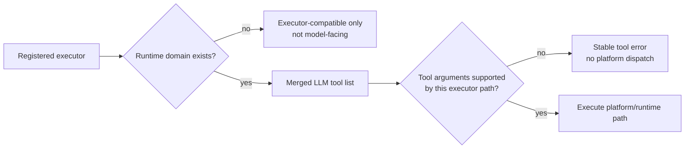

# Model tool admission guardrails

Status: **implemented (v1)**.

This document covers two related guardrails that complement **`entity-set-analysis`** and
**`legacy-discovery-executor-only`**:

1. **`query_entities.query` predicate admission** — reject unsupported or malformed model-generated predicates before
   dispatching to ThingWorx platform services.
2. **`get_agent_skill` empty-catalog advertisement** — omit the skill-body loader from the merged LLM tool list when the
   runtime skill catalog is empty, while preserving executor compatibility.

## Background

Parler's model-facing tool surface is kept small:

- **`analyze_entity_set`** provides deterministic cached entity-list set algebra.
- Legacy discovery names remain executable but are not advertised by default (**`legacy-discovery-executor-only.md`**).
- Extended tools can be marked **`executorOnly`**, which keeps execution and playbook validation available while hiding
  the tool from the merged LLM list.

The issue is not simply "too many tools", and tool-count reduction is not the first answer to every context or TPM
problem. The more precise problem is **admission**:

- A tool argument shape may be syntactically accepted by JSON Schema but unsupported by the current executor path.
- A tool may be registered globally but have an empty runtime domain in the current AgentThing configuration.

The LLM should not be handed capabilities that are impossible or misleading in the current runtime state, and unsupported
inputs should fail at Parler's boundary with stable repair guidance instead of falling through to opaque platform errors.

## Motivation

### Predicate failure after entity-set analysis

The original entity-set live failure had two causes:

- Parler lacked a deterministic set primitive, so the model tried to subtract one entity list from another by paging rows
  into context or generating negative filters.
- **`query_entities.query`** accepted model-generated query JSON and forwarded it to ThingWorx. When the model produced a
  composite negative predicate, the platform failed with low-level text such as **`JSONObject["fieldName"] not found`**.

The first problem is solved by **`analyze_entity_set`**. The second is solved by predicate admission (Slice A): unsupported
predicate shapes no longer reach the platform dispatch boundary.

### Empty skill catalog still advertises `get_agent_skill`

`get_agent_skill` is the right progressive-disclosure mechanism when repository skills exist. The model sees metadata in
the per-turn skill catalog and can call **`get_agent_skill({"skill_name":"..."})`** to load the full body.

But when the skill catalog is empty, the domain of **`get_agent_skill`** is empty. Advertising the loader still invites
the model to invent skill names or count a capability that has nothing to load. This is the same configuration-state
pattern already used by **`start_playbook`**: no loaded playbook catalog means no model-facing **`start_playbook`**.

## Shared Principle

Model-facing tool admission has two gates:



The distinction matters:

- **Registration** answers "can Parler execute this name if replay, HITL continuation, or orchestrated code calls it?"
- **Advertisement** answers "should the model see this tool schema in this turn?"
- **Argument admission** answers "should this particular model-generated payload reach the platform?"

This topic changes advertisement and argument admission. It does **not** remove executor compatibility.

## Contract and wire scope

- **Normative UI / client wire (`CONTRACTS/*`):** unchanged; no UI or external client normatively depends on these
  fields.
- **Slice A tool errors:** the JSON envelope (`status`, `code`, `message`, `path`, optional **`recoveryHint`**) is
  **agent tool JSON** for LLM / tool repair hints. It is documented in this file only; it is **not** a
  **`CONTRACTS/API_CONTRACT.md`** or **`CONTRACTS/CONTRACT_VERSION.md`** bump while adoption stays agent-internal.
- **`GetAgentRuntimeSnapshot`:** additive diagnostics (e.g. **`modelFacingSuppressed`**) are **operator diagnostics**,
  not AlwaysOn / widget normative wire. Document here and in **`docs/agent/configuration-repository.md`**; no
  **`CONTRACTS`** bump unless snapshot JSON is intentionally promoted to a normative client API later.

### `recoveryHint` (Slice A, v1 — fixed shape)

When a rejection should steer the model toward cached set difference, **`recoveryHint`** MUST be present and MUST equal
exactly:

```json
{ "tool": "analyze_entity_set", "operation": "difference" }
```

No additional keys, no alternate tool names, and **no arbitrary JSON** in v1. Rejections that do not use this steer MUST
omit **`recoveryHint`**.

### Generated exclusion heuristic (Slice A, v1)

v1 **does not** use a wide-**`OR`** branch-count heuristic with a set-difference **`recoveryHint`**: legitimate positive
disjunctions are common; **`MAX_LEAVES`** already bounds **`OR`** width (same constant as cached tabular tools).

Implementations MUST NOT invent informal “looks generated” detectors. Allowed rejections for “subtraction via
**`query_entities`**” in v1 are:

1. **Composite `NOT`** (valid arity: exactly one child in the **`filters`** array) — **`UNSUPPORTED_PREDICATE_FOR_QUERY_ENTITIES`**
   with the fixed **`recoveryHint`** under **`recoveryHint` (Slice A, v1 — fixed shape)**. Wrong **`NOT`** arity remains
   **`INVALID_PREDICATE`** (malformed).
2. **Leaf / depth / size limits** — reuse **`ParlerQueryFilterParser.MAX_LEAVES`** (**`32`**) and
   **`ParlerQueryFilterParser.MAX_COMPOSITE_DEPTH`** (**`4`**) via **`countLeaves` / `maxCompositeDepth`** on the
   **`query.filters`** subtree; surface **`TOO_MANY_PREDICATES`** (same code and semantics as cached tabular predicate
   tools) so models see one vocabulary for “too big” predicates.

All other unsupported shapes use **`INVALID_PREDICATE`**, **`UNSUPPORTED_OPERATOR`** (Parler-only leaf types such as
**`CONTAINS`**), or **`UNSUPPORTED_PREDICATE_FOR_QUERY_ENTITIES`** as appropriate — no ad-hoc v1 extensions.

### Shared structural rules with `ParlerQueryFilterParser`

Depth and leaf counts MUST use **`ParlerQueryFilterParser.countLeaves`** and **`ParlerQueryFilterParser.maxCompositeDepth`**
on the **`query.filters`** node so caps cannot drift from **`docs/agent/query-spec.md`**. **`QueryEntitiesQueryAdmission`**
duplicates only the arity / composite shape checks that already mirror the parser.

## Goals

- Reject malformed or unsupported **`query_entities.query`** shapes before ThingWorx platform dispatch.
- Return stable JSON tool errors with repair hints for unsupported predicates.
- Steer negative cross-list workflows to:
  1. source list A via **`query_entities`** or another cached list tool;
  2. source list B via **`query_entities_by_taxonomy`** or another cached list tool;
  3. **`analyze_entity_set(operation="difference")`** for exact subtraction.
- Hide **`get_agent_skill`** from the merged LLM tool list when no skills are registered in the current
  **`PromptContextCacheSnapshot.skillRegistry`**.
- Preserve **`get_agent_skill`** execution for explicit slash workflows, replay, continuation, and any server-owned path
  that already knows the skill id.
- Expose enough runtime diagnostics that operators can see why a tool is executable but not model-facing.
- Keep the implementation offline-testable where possible.

## Non-goals

- Do not implement a full Parler query engine.
- Do not implement composite **`NOT`** semantics unless a real platform-compatible or Parler-owned execution path is
  added with tests.
- Do not add direct ThingWorx operands to **`analyze_entity_set`**.
- Do not inline long exclusion lists into **`query_entities`** as a replacement for cached set operations.
- Do not hide **`get_agent_skill`** when one or more repository skills are registered.
- Do not change **`/SkillName`** slash loading semantics.
- Do not delete **`get_agent_skill`** from the registry solely because the current catalog is empty.
- Do not change **`CONTRACTS/*`** for Slice A tool-error fields or additive snapshot diagnostics while they remain
  agent-only / operator-only (see **Contract and wire scope** above).

## Slice A: `query_entities.query` Predicate Admission

### QUERY envelope vs. `query.filters`

**`query_entities.query`** is a ThingWorx **QUERY object** (pagination, sorts, **`filters`**, …). Predicate admission applies **only** to the **`filters`** subtree when present:

1. Validate the **envelope** first: **`QueryJsonPrimitiveMapper.parseQueryObject`** + **`validateQueryObject`** (accepts
   structured objects **or** textual JSON objects per **`QueryJsonPrimitiveMapper`**, same as the executor).
2. **Normalize** the parsed **`org.json.JSONObject`** back to a Jackson **`JsonNode`** and run **all** predicate checks
   (including **`query.filters`**) on that tree so textual and object **`query`** arguments share one admission path.
3. When **`query.filters`** is absent or JSON-null on the normalized tree, **skip** predicate admission (preserve no-query
   and sorts-only paths).
4. When **`query.filters`** is present, it MUST be a **JSON object** (single leaf or **`AND`** / **`OR`** / **`NOT`**
   composite). Never require **`fieldName`** on the QUERY root.

### Boundary

The runtime should classify **`query.filters`** (when present) into three buckets before dispatch:

| Bucket | Action | Examples |
|--------|--------|----------|
| Platform-compatible | Pass through unchanged after shape validation. | Leaf predicates with required **`fieldName`** and value keys; **`AND`** / **`OR`** composites whose children are valid; ThingWorx-native **`type`** only (see **Leaf allowlist**). |
| Malformed | Reject with **`INVALID_PREDICATE`** (or wrong-arity **`NOT`**) before platform dispatch. | Missing **`fieldName`** on a leaf; **`filters`** not an array under composite; empty **`AND`** / **`OR`**; **`NOT`** with zero or multiple children. |
| Unsupported in this executor path | Reject with **`UNSUPPORTED_PREDICATE_FOR_QUERY_ENTITIES`** (composite **`NOT`** with valid arity only) or **`UNSUPPORTED_OPERATOR`** (Parler-only leaf types). | Well-formed composite **`NOT`**; **`CONTAINS`** / substring / empty-string Parler leaves. |

`query_entities` rejects composite **`NOT`** instead of trying to emulate it. This keeps the implementation honest:
**`docs/agent/query-spec.md`** may define a broader Parler-facing predicate vocabulary, but **`query_entities`** should
not pretend the current platform dispatch path supports every spec shape.

### Leaf allowlist (`query_entities` platform pass-through)

Admit **only** ThingWorx-native leaf **`type`** values that can pass through to **`FilterFactory`** / QIT (case-insensitive **`type`**, original JSON unchanged):

**`EQ`**, **`NE`**, **`LT`**, **`LE`**, **`GT`**, **`GE`**, **`IN`**, **`NOTIN`**, **`BETWEEN`**, **`NOTBETWEEN`**, **`LIKE`**, **`NOTLIKE`**, **`MISSINGVALUE`**, **`NOTMISSINGVALUE`**, **`NEAR`**, **`NOTNEAR`**, **`TAGGED`**, **`NOTTAGGED`**, plus **`FilterFactory`** spellings for the above where they differ.

**v1 omission:** **`MATCHES`** / **`NOTMATCHES`** are **not** admitted on **`query_entities`** (same stance as
**`ParlerQueryFilterParser`** cached path — regex surface); they are rejected with **`UNSUPPORTED_OPERATOR`**.

Per-type structural requirements (enforced in **`QueryEntitiesQueryAdmission`**): non-null **`value`** for scalar
comparisons and **`LIKE`** / **`NOTLIKE`** (with LIKE pattern length cap mirroring **`ParlerQueryFilterParser`**); non-empty
**`tags`** for **`TAGGED`** / **`NOTTAGGED`**; existing **`IN`**, **`BETWEEN`**, **`NEAR`** checks; **`MISSINGVALUE`** does not
require **`value`**.

**Reject** Parler extension leaves that build in-memory **`IFilter`** implementations only (**`CONTAINS`**, **`NOTCONTAINS`**, **`STARTSWITH`**, **`NOTSTARTSWITH`**, **`ENDSWITH`**, **`NOTENDSWITH`**, **`ISEMPTY`**, **`NOTEMPTY`**) with **`UNSUPPORTED_OPERATOR`** and a short explanation.

Allowed top-level keys on each **leaf** object: same set as **`ParlerQueryFilterParser`** **`ALLOWED_LEAF_KEYS`** (see **`ParlerQueryFilterParser.isAllowedLeafKeyForPlatformQuery`**).

### Validator

**`QueryEntitiesQueryAdmission`** (offline-testable; no ThingWorx static init) accepts the tool JSON **`query`**
node as Jackson **`JsonNode`** and returns either **`null`** (success) or a UTF-8 JSON tool error string:

- **`code`** — stable error code;
- **`message`** — short model-facing explanation;
- **`path`** — rejected JSON path such as **`query.filters[0].fieldName`**;
- **`recoveryHint`** — optional; when present in v1 it MUST be exactly the fixed object defined under **`recoveryHint`
  (Slice A, v1 — fixed shape)** in **Contract and wire scope**.

### Runtime Wiring

**`QueryEntitiesQueryAdmission.validateOrErrorJson(queryNode)`** runs immediately after reading **`query`** from the tool
arguments and **before** key resolution / **`buildImplementingThingsParams`**. Admission internally runs the same
**`QueryJsonPrimitiveMapper.parseQueryObject`** + **`validateQueryObject`** pair as the executor, then traverses a
**normalized** Jackson view of the QUERY object so textual and structured **`query`** inputs share one predicate gate.

If rejected, the JSON string is returned as the tool result. Ordinary model input mistakes do not throw Java exceptions.

Error shape (composite **`NOT`**):

```json
{
  "status": "error",
  "code": "UNSUPPORTED_PREDICATE_FOR_QUERY_ENTITIES",
  "message": "query_entities.query does not support composite NOT on this path. Build both cached entity lists and call analyze_entity_set with operation=\"difference\".",
  "path": "query.filters",
  "recoveryHint": {
    "tool": "analyze_entity_set",
    "operation": "difference"
  }
}
```

### Routing Copy

**`llm_tool_routing_guide.txt`** and **`BuiltInTools.queryEntitiesDef()`** copy:

- use **`query_entities.query`** only for ordinary positive platform-compatible filters;
- do not generate large negative filters to subtract one entity list from another;
- use **`analyze_entity_set`** for cross-cache difference, intersection, union, and symmetric difference.

## Slice B: Empty Skill Catalog Tool Advertisement

### Registration

**`BuiltInTools.registerAll(...)`** always registers **`get_agent_skill`** as a normal built-in **`ToolDefinition`**, which
keeps executor compatibility. **`AgentThing.getMergedToolDefinitions()`** starts from **`_toolRegistry.getAllDefinitions()`**
and then applies the catalog gate below.

### Behavior

When the current prompt-context snapshot has zero registered skills:

- **`get_agent_skill`** remains executable through **`ToolRegistry.executeTool(...)`**.
- **`get_agent_skill`** is omitted from the merged LLM tool list.
- The per-turn skill catalog remains empty.
- **`GetAgentRuntimeSnapshot`** reports that **`get_agent_skill`** is currently not model-facing because the skill catalog
  is empty.

When one or more skills are registered:

- **`get_agent_skill`** appears in the merged LLM tool list as it does today.
- The existing skill catalog text continues to tell the model to call **`get_agent_skill`** for full bodies.
- `/SkillName`, dynamic checklist merge, HITL continuation snapshots, and task-state v1b.2 remain unchanged.

### Implementation

**`get_agent_skill`** stays in the registry. The gate is a merged-list filter:

```text
ToolRegistry:
  get_agent_skill registered and executable

AgentThing.getMergedToolDefinitions():
  include get_agent_skill only when skill registry has at least one descriptor
```

This mirrors the extended-tool **`executorOnly`** principle but is configuration-state driven, not manifest-driven.

The helper **`ModelFacingSkillAdmission.hasModelFacingSkills(PromptContextCacheSnapshot snap)`** is conservative:

- return **`false`** when the snapshot is null, missing, invalid, or has zero descriptors;
- return **`true`** when at least one registered skill descriptor exists.

### Snapshot Diagnostics

`GetAgentRuntimeSnapshot.tools.builtIn` currently lists static built-in `ToolDefinition` names from the registry, not the
exact merged LLM list (as documented for **`start_playbook`**). The snapshot therefore reports **`get_agent_skill`**
suppression explicitly.

**Shape:** **`modelFacingSuppressed`** is an **array of `{ "name", "reason" }`** objects (additive; not
a map), for forward-compatible operator fields.

```json
{
  "tools": {
    "builtIn": ["..."],
    "modelFacingSuppressed": [
      {
        "name": "get_agent_skill",
        "reason": "empty_skill_catalog"
      }
    ]
  }
}
```

Do not overload **`tools.executorOnly`** for this case. **`executorOnly`** is a registration category; empty-skill
suppression is a runtime advertisement decision.

### `enableBuiltInTools=false`

Today, when **`enableBuiltInTools=false`**, **`BuiltInTools.registerGetAgentSkillOnly(...)`** still registers
**`get_agent_skill`** so the skill catalog text remains coherent.

The executor behavior is the same; the merged list still honors the catalog gate:

| Built-ins enabled | Skill catalog | Executor registered | Model-facing `get_agent_skill` |
|-------------------|---------------|---------------------|--------------------------------|
| true | empty | yes | no |
| true | non-empty | yes | yes |
| false | empty | yes | no |
| false | non-empty | yes | yes |

**`enableBuiltInTools=false`** does not mean "no model-facing tools at all"; the established skill exemption stays.

## Tests

### Slice A

Minimum offline tests:

- valid QUERY envelope with **`filters`** only (leaf **`EQ`**) passes (structured JSON **or** textual JSON **`query`** per **`QueryJsonPrimitiveMapper`**);
- valid QUERY with **`sorts`** / **`pagination`** only (no **`filters`**) passes;
- textual **`query`** with composite **`NOT`** is still rejected at **`query.filters`** (no gate bypass);
- leaf missing **`fieldName`** rejects before platform dispatch;
- scalar **`EQ`** / **`LIKE`** without **`value`** rejects; **`TAGGED`** without non-empty **`tags`** rejects;
- **`MATCHES`** rejected as **`UNSUPPORTED_OPERATOR`** in v1;
- **`MISSINGVALUE`** without **`value`** passes;
- composite child **`filters`** not an array rejects;
- empty **`AND`** / **`OR`** rejects;
- composite **`NOT`** (valid arity) rejects with **`UNSUPPORTED_PREDICATE_FOR_QUERY_ENTITIES`** and fixed **`recoveryHint`**;
- **`NOT`** with invalid child count rejects as **`INVALID_PREDICATE`**;
- leaf count over **`ParlerQueryFilterParser.MAX_LEAVES`** rejects with **`TOO_MANY_PREDICATES`**;
- Parler-only leaf (**`CONTAINS`**, …) rejects with **`UNSUPPORTED_OPERATOR`**;
- existing simple **`query_entities`** tests remain green.

The test suite should not need a live ThingWorx server.

### Slice B

Minimum tests:

- empty skill registry suppresses **`get_agent_skill`** from **`getMergedToolDefinitions()`** or an extracted planner
  helper;
- non-empty skill registry includes **`get_agent_skill`**;
- **`ToolRegistry.executeTool("get_agent_skill")`** remains available in both cases;
- **`ModelFacingSkillAdmissionTest`** — empty vs non-empty skill registry gating for **`ModelFacingSkillAdmission.hasModelFacingSkills`**.
- **`enableBuiltInTools=false`** preserves the same catalog gate behavior;
- task-state dynamic merge tests for successful **`get_agent_skill`** remain green.

The gate is tested through the pure helper rather than through the platform-heavy
**`AgentThing.getMergedToolDefinitions()`**.

## Guarantees

- No unsupported model-generated **`query_entities.query`** shape should reach ThingWorx and produce
  **`JSONObject["fieldName"] not found`**.
- Unsupported predicate errors must be stable JSON tool errors with repair guidance where applicable (**`UNSUPPORTED_PREDICATE_FOR_QUERY_ENTITIES`** + fixed **`recoveryHint`** for composite **`NOT`** only in v1).
- "A minus B" prompts should be steered to **`analyze_entity_set`**, not generated **`query_entities.query.NOT`**.
- When the skill catalog is empty, the model-facing tool list should not include **`get_agent_skill`**.
- When skills exist, **`get_agent_skill`** should remain model-facing and behave as today.
- Runtime snapshot / collection bundles must explain suppression, not make operators infer it from missing names.
- Executor compatibility must remain intact for replay, continuation, and server-owned paths.

## Out Of Scope But Related

- Full **`docs/agent/query-spec.md`** implementation.
- Tool-profile planning from **`docs/agent/tool-surface-budget.md`**.
- Merging resolver, alert, or entity enumeration tool families.
- Hiding extended tools dynamically based on empty runtime domains beyond the explicit **`executorOnly`** manifest flag.
- Adding hard prompt text to deny non-Parler wrapper tools such as **`parallel`**. That behavior should remain observable
  rather than hidden by a blanket system-prompt patch.
