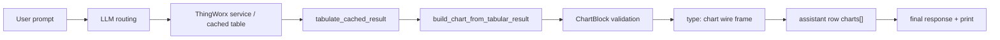

# Prompt to chart

Scope: Parler agent, chart wire contract and `<parler-ui>` rendering for charts built from tabular results.

This document describes how a natural-language chart request becomes a validated `ChartBlock`: pie charts,
grouped bars through `seriesColumn`, percent/share derived operations, tool-result provenance, and the
runtime rules that keep chart requests from ending as text only (§7.5–§7.6 chart rescue and `last_invoke`).
Normative wire rules are in [`CONTRACTS/CHART_CONTRACT.md`](../../CONTRACTS/CHART_CONTRACT.md); telemetry fields
in [`CONTRACTS/API_CONTRACT.md`](../../CONTRACTS/API_CONTRACT.md). Related documents:
[`chart-intent.md`](./chart-intent.md) (intent mode, `chartId`),
[`multi-chart-and-thrashing-safeguards.md`](./multi-chart-and-thrashing-safeguards.md) (several charts per turn),
[`docs/ui/chart-from-json.md`](../ui/chart-from-json.md) (JSON tool results as chart sources), and the
chart product design [Chart enhancement](nearterm/chart-enhancement.md).

## 1. Purpose

Parler prints the final response and attaches tables and charts to the same assistant row as structured
artifacts. A chart request therefore does not produce "a chart described in Markdown": the agent builds a
validated `ChartBlock` from real ThingWorx data or a cached tabular result, the UI attaches it to the assistant
row, and it is included when the response is printed.

Two common industrial requests show the path:

1. The share of time one device spent in each state over a period, as a pie chart.
2. Two devices compared by state over the same period, as a grouped bar chart: states on the x-axis, the
   devices side by side within each state.

```text
real service / cached table
  -> deterministic tabular aggregation / transform
  -> validated ChartBlock
  -> assistant final response with chart + short interpretation
  -> print / export
```

## 2. Principles

- The LLM recognizes visual intent, chooses tools, and declares column mappings and parameters.
- The LLM never invents chart coordinates. Chart data comes from a ThingWorx service, a cached table, or a
  deterministic tabular transform — never from prose or `sampleRows`.
- When the user explicitly asks for a chart, the success path includes a `type: "chart"` wire frame, not a
  sentence saying a chart could be drawn.
- The final response does not repeat the full table. It gives the chart title or scope, two to four insights,
  necessary caveats, and the source.

## 3. Example prompts

Single-device pie:

```text
Show the share of time that SE.CellFab.Model.Workunit.AC-BenchScale-01 spent in each utilization state on 2025-09-10 as a pie chart.
```

```text
For SE.CellFab.Model.Workunit.AC-BenchScale-01, show the percentage of time spent in each utilization state on 2025-09-10 as a pie chart.
```

Two-device grouped bar (percentage or duration on the y-axis):

```text
Compare SE.CellFab.Model.Workunit.AC-BenchScale-01 and SE.CellFab.Model.Workunit.AC-BenchScale-02 by utilization state on 2025-09-10 as a grouped bar chart. Put the utilization states on the x-axis and show the two assets side by side for each state. Use percentage of time as the y-axis.
```

```text
Show a grouped bar chart comparing the utilization-state percentages for AC-BenchScale-01 and AC-BenchScale-02 on 2025-09-10.
```

Process-parameter requests follow the same architecture:

```text
Show Speed over the last two shifts for all Metallization machines as a line chart.
```

```text
Compare Aluminum Evaporator Power for the last two shifts across all Metallization machines as a grouped bar chart.
```

```text
Show a histogram of Optical Density for the last 20 production runs.
```

## 4. Architecture

```text
User prompt
  -> LLM selects data source / tool chain
  -> invoke_service or built-in query tool returns InfoTable / cached table
  -> tabulate_cached_result transforms or aggregates the table
  -> build_chart_from_tabular_result builds and validates ChartBlock
  -> agent emits type:"chart" wire frame for the same request_id
  -> final response references chartId/title and summarizes findings
  -> UI row stores markdown + charts[]; print includes both
```



| Layer | Responsibility |
|---|---|
| LLM | Decide whether a chart is wanted, choose kind or intent, choose tools, map column names |
| ThingWorx service / data tool | Return real structured data |
| `tabulate_cached_result` | Deterministic transforms: filter, aggregate, share, sort, trim |
| `build_chart_from_tabular_result` | Map a table to a `ChartBlock` and run chart-specific validation |
| Agent runtime | Emit the `type: "chart"` frame on the same `request_id` as the final text |
| UI | Render, interact, print; defensively drop invalid charts |

## 5. Product boundaries

- A pie chart is produced only with explicit `kind: "pie"`. `intent: "composition"` selects a sorted bar, not
  a pie (see §12.6).
- Grouped bars use `kind: "bar"` with several `series[]`; there is no `grouped_bar` kind.
- The chart builder validates the mapping, numeric values, category and series counts, and payload size.
- Every chart from `build_chart_from_tabular_result` carries `ChartBlock.source`.
- The UI validates defensively and renders; it performs no business calculation.
- The model does not emit arbitrary Vega/ECharts specifications, and there is no drag-and-drop dashboard
  editing.

## 6. Chart kinds

`ChartBlock.kind` is one of `line`, `bar`, `scatter`, `pie`, `histogram`, `boxplot`, `heatmap`
(`CHART_CONTRACT.md` §3). This document covers `pie` and grouped `bar`; histogram (`bin_numeric` source),
boxplot (`box_summary` source) and heatmap (two-key long table) are described in `CHART_CONTRACT.md` and
[`cached_tabular_tools.md`](./cached_tabular_tools.md).

## 7. Contract and runtime semantics

### 7.1 `kind: "pie"` and builder limits

`pie` is part of the `ChartBlock.kind` set. The builder limits are contract constants
(`ParlerTabularChartBuilder`):

| Constant | Value | Meaning |
|---|---:|---|
| `PIE_DEFAULT_MAX_SLICES` | 8 | Default maximum of visible non-zero slices; beyond it, top-N plus `Other` |
| `PIE_HARD_MAX_SLICES` | 12 | Hard maximum of non-zero slices in `all_nonzero` mode |
| `BAR_MAX_SERIES` | 6 | Maximum series for grouped bars |
| `BAR_MAX_CATEGORIES` | 24 | Maximum categories for grouped bars |

The series and category limits reflect the default bubble width: beyond about six series the legend crowds,
and beyond about 24 categories tick labels and bar spacing become unreadable.

### 7.2 Pie payload reuses `series[]`

A pie uses `series[0].x[]` / `series[0].y[]`:

```json
{
  "kind": "pie",
  "chartId": "c1",
  "title": "Utilization-state breakdown — AC-BenchScale-01 — 2025-09-10",
  "x_label": "Utilization State",
  "y_label": "Percentage of time",
  "series": [
    {
      "name": "Utilization State",
      "x": ["Running", "Idle", "Stopped"],
      "y": [62.4, 21.8, 15.8]
    }
  ],
  "source": {
    "sourceResolved": "cache_id",
    "sourceCacheId": "cache-...",
    "sourceResultKind": "CACHED_TABULATE_GROUP_METRIC",
    "sourceColumns": ["UtilizationState", "state_percent"],
    "transformSummary": "sum Duration by UtilizationState; percent_of_total(Duration)",
    "rowCount": 3,
    "pointCount": 3,
    "truncationApplied": false
  }
}
```

Pie invariants are rejection rules, not preferences:

- `series.length == 1`, else the builder returns `PIE_REQUIRES_SINGLE_SERIES`; the UI adapter drops the block.
- `series[0].x.length == series[0].y.length`, else `ROW_ALIGN_FAILED`; the UI adapter drops the block.
- Every `series[0].y[]` value is finite and non-negative, else `Y_COLUMN_NOT_NUMERIC` or `PIE_NEGATIVE_VALUE`;
  the UI adapter drops the block.
- `series[0].name` is the legend group label, for example `Utilization State`.
- The values may sum to 100 or be durations or quantities; the UI normalizes by `sum(y)` to show shares.
- All values zero → `PIE_ZERO_TOTAL`; no chart is emitted.
- A zero-value slice draws no arc; the legend and tooltip may show `0` or `0.0%`.
- Default `pieSliceMode: "top_with_other"` with `pieMaxSlices: 8`: when there are more non-zero slices, the
  builder keeps the largest seven by value and merges the rest into `Other`, and sets
  `truncationApplied: true` in the tool result and in `ChartBlock.source`.
- When the user explicitly asks for all slices, the model passes `pieSliceMode: "all_nonzero"` and
  `pieMaxSlices: 12`; more than 12 non-zero slices returns `TOO_MANY_SLICES`, suggesting a bar chart or a table.
- Zero-value categories do not count toward `pieMaxSlices`, are not merged into `Other`, and draw no arc.
- When `Other` exists, the final response says that small categories were merged into `Other`.

### 7.3 Source and provenance metadata

`ChartBlock.source` (see `CHART_CONTRACT.md` for the normative table):

| Field | Type | Required for `build_chart_from_tabular_result` | Description |
|---|---|---:|---|
| `sourceResolved` | string | yes | How the input was resolved, e.g. `last_invoke` or `cache_id` |
| `sourceCacheId` | string | no | Tabular cache id of the final table, when one exists |
| `sourceToolCallId` | string | no | Originating tool call id when the runtime exposes it (not currently set by this builder) |
| `sourceResultKind` | string | no | Source result kind, e.g. `CACHED_TABULATE_GROUP_METRIC` |
| `sourceColumns` | string[] | yes | Columns used, including x, y and series columns |
| `transformSummary` | string | no | Short description of the deterministic transform |
| `rowCount` | number | yes | Input row count |
| `pointCount` | number | yes | Chart points or slices |
| `truncationApplied` | boolean | yes | Whether top-N / `Other` / slice merging happened |
| `filledMissingCombinations` | number | no | Grouped bar: series/category combinations filled with 0 |
| `zeroValueCategoryCount` | number | no | Pie: zero-value categories not drawn as slices |

Rules:

- Every chart produced by `build_chart_from_tabular_result` has `ChartBlock.source`.
- The UI still accepts older or third-party charts without `source`.
- The tool success JSON returns provenance aligned with `ChartBlock.source`: at least `sourceResolved`,
  `sourceColumns`, `rowCount`, `pointCount`, `truncationApplied` (plus the same value as legacy `truncated`),
  `sourceCacheId` when available, and a nested `source` object of the same shape as the wire
  `ChartBlock.source`, so the model can read `filledMissingCombinations`, `zeroValueCategoryCount` and
  `transformSummary` directly.
- Print and history replay keep the provenance; print output keeps at least the chart title.

### 7.4 Wire frame ordering

`pie` does not change `type: "chart"` ordering. A chart frame may arrive before, between or after the
`content.delta` frames of the same `request_id`; the UI attaches it to the same assistant row by `request_id`.
No chart kind introduces a new streaming lifecycle.

### 7.5 `answerSetComplete` and `build_chart_from_tabular_result` in post-marker rounds

When a `tabulate_cached_result` success carries **`answerSetComplete`** (or equivalent complete-answer-set
semantics, see [`query-spec.md`](./query-spec.md) §11), `AgentLoop` schedules a **post-marker** round. By default
that round exposes **no tools** (`tool_choice: none`) so the model answers directly.

**Exception (chart unblock):** if the turn meets the **behavior-derived chart-rescue condition** —
`build_chart_from_tabular_result` has been called, `parlerChartWireEmittedCount` is still 0, a recoverable
chart build error such as `DUPLICATE_SLICE_LABEL` occurred, and a complete chartable tabular source exists
(as computed by `AgentToolContext.eligibleChartRescueToolExposureForTurn()`; the user's wording is never
parsed for "wants a chart") — and no `type: chart` frame has been delivered, the post-marker round **still
exposes exactly one tool**, the built-in `build_chart_from_tabular_result`, so the model can build the chart
from the complete small table. Once it succeeds and the chart wire is marked as emitted, the next round returns
to normal routing (all tools or text only, as the model and later rounds decide).
**`noToolFinalAnswerApplied`** telemetry is set only when a post-marker round is actually sent with zero tools;
the chart-rescue round is not counted as a no-tool final answer.

**Answer Presentation Phase (aggregate-first, not rescue):** when the chart-rescue condition does **not**
hold, but the turn has registered at least one **complete chartable** tabulate artifact in
`PresentationArtifactRegistry` (indexed by top-level **`cacheId`**), at least one of those artifacts is **not
yet** the source of a chart delivered in this turn (checked per artifact against the chart's
`source.sourceCacheId`, not "no chart wire yet in this turn"), and the presentation round budget is not used
up, the post-marker round exposes **only** `build_chart_from_tabular_result`. The model may issue **several**
builds in that round (executed serially; more than **6** are rejected with a `PRESENTATION_ACTION_LIMIT` error
JSON). After that tool round, `AgentLoop` forces **one** more round with `tool_choice: none` for the summary;
**`noToolFinalAnswerApplied`** is set only on that forced summary round. The per-artifact check matters because
`query_property_history` delivers its own numeric-history line chart (without `source.sourceCacheId`); a
turn-level "no chart wire yet" condition would close the presentation round and the sequence "read history →
`bin_numeric` / `box_summary` / `group_metric` → build chart" could never reach the build. An artifact that is
already the source of a delivered chart does not reopen the round. The chart-rescue condition
(`chartExpectedButMissing`, `parlerChartWireEmittedCount == 0`) is unchanged. Telemetry fields:
[`llm-performance.md`](./llm-performance.md) (`presentationPhaseEntered` and others) and
[`multi-chart-and-thrashing-safeguards.md`](./multi-chart-and-thrashing-safeguards.md) §4.4.1.

### 7.6 End-of-turn restricted chart rescue and `last_invoke`

When the **same behavior-derived rescue condition** (see the §7.5 exception and
`eligibleChartRescueToolExposureForTurn()`) holds, no chart wire has been sent, and the turn already has a
**complete chartable tabular success** — a `tabulate_cached_result` complete answer set; an `INFOTABLE` /
`INFOTABLE_LARGE` result from `invoke_service`, an extended tool or similar without truncation signals such as
`sampleOnly` / `rowsOmitted`, or with `returnedRows == totalRows`; or a JSON root `rows` single table that meets
the `last_invoke` conditions below — and the model ends a round that **still exposed all tools** with a
**plain-text STOP** without calling `build_chart_from_tabular_result`, `AgentLoop` adds **at most one**
restricted round that exposes **only** `build_chart_from_tabular_result`, with `tool_choice` not `none`. It
reuses the tool-list construction of the §7.5 post-marker singleton. A truncated sample is never silently
charted as complete data.

**`last_invoke` (latest-wins within the current request):** a success JSON of any tool (including extended
tools from the configuration repository) in `invoke_service` shape — `status: success` with `resultKind:
INFOTABLE` / `INFOTABLE_LARGE`, or `resultKind: JSON` whose decoded `result` business object is a complete
single table: business `status` absent or `success`, root `rows` a non-empty array of objects, no partial-page
signal (`hasMore` or `truncated` true, `offset` > 0, or `totalRows` ≠ `returnedRows`), and the row and size
limits described in [`docs/ui/chart-from-json.md`](../ui/chart-from-json.md) §4.3 — updates
`TabularChartRoundState` and the conversation-level last-qualifying-cache mirror. JSON that does not qualify
is not a chart source and leaves `last_invoke` unchanged. When the request has **several** qualifying tabular
successes, `source: last_invoke` **always resolves to the most recent one** (the latest-wins fields of
`TabularChartRoundState`). To use an **earlier** result, pass **`source: cache_id`** with an explicit
**`cacheId`** that a result actually returned. The end-of-turn rescue and ordinary
`build_chart_from_tabular_result` calls share these semantics; `last_invoke` is never refused because of
"several candidates". `last_invoke` starts empty on every new user request.

**Telemetry:** the terminal `llm_usage` / `LLM_TURN_PERFORMANCE` event carries the optional boolean
**`chartRescueAttempted`**: `true` exactly when the turn **actually scheduled the end-of-turn restricted rescue
round** above (distinct from a §7.5 post-marker singleton). **`chartExpectedButMissing`** is `true` exactly when
the turn called `build_chart_from_tabular_result` and no `type: "chart"` frame succeeded
(`parlerChartWireEmittedCount == 0`); it never depends on prompt keywords and appears in logs, not on the UI
wire. See [`llm-performance.md`](./llm-performance.md) and `CONTRACTS/API_CONTRACT.md`.

**INFOTABLE row binding:** when an extended tool takes INFOTABLE input, a **missing key** in a JSON row differs
from **`"col": null`**: a missing key on a required column is still a *missing required column*. For a key that
is present with JSON `null`, the conversion layer does **not** infer extra non-null constraints from
`isRequired`: unless **`isPrimaryKey`** is known to be true, the column is treated as nullable and a ThingWorx
null is written; JSON `null` on a primary-key column → **`NULL_VALUE_NOT_ALLOWED`**. When metadata cannot be
read, the primary key is treated as unknown and the column as nullable.

## 8. Agent tools

### 8.1 `build_chart_from_tabular_result`

`kind` accepts `pie`, and `seriesColumn` expands a long table:

```json
{
  "source": "cache_id",
  "cacheId": "cache-...",
  "kind": "bar",
  "xColumn": "UtilizationState",
  "seriesColumn": "EquipmentDesc",
  "yColumn": "state_percent",
  "title": "Utilization-state comparison — 2025-09-10",
  "xLabel": "Utilization State",
  "yLabel": "Percentage of time"
}
```

- There is no `grouped_bar` kind.
- `seriesColumn` pivots a long table (`xColumn`, `seriesColumn`, `yColumn`) into several `series[]`. It
  requires `yColumn` and cannot be combined with an explicit `series[]`. It applies to `bar`, `line` and
  `scatter` (and supplies the row dimension of `heatmap`).
- Two rows with the same `seriesColumn` + `xColumn` combination return `DUPLICATE_SERIES_CATEGORY`; the builder
  never aggregates.
- In a grouped bar, missing series/category combinations are filled with 0 and counted in
  `filledMissingCombinations`.
- At most 6 series (`TOO_MANY_SERIES`) and 24 categories (`TOO_MANY_CATEGORIES`) for grouped bars; reduce
  upstream with `tabulate_cached_result` (top-N or `Other`) when needed.
- `sortBarByPrimaryYDescending` does not break category alignment across grouped series.

A pie uses `xColumn` for slice labels and `yColumn` for values:

```json
{
  "source": "cache_id",
  "cacheId": "cache-...",
  "kind": "pie",
  "xColumn": "UtilizationState",
  "yColumn": "state_percent",
  "title": "Utilization-state breakdown — AC-BenchScale-01 — 2025-09-10",
  "xLabel": "Utilization State",
  "yLabel": "Percentage of time",
  "pieSliceMode": "top_with_other",
  "pieMaxSlices": 8
}
```

- `pieSliceMode` applies only to `kind: "pie"`: `top_with_other` (default) or `all_nonzero`.
- `pieMaxSlices` applies only to pies: default 8, range 2..12; outside the range → `INVALID_PARAMETERS`.
- `top_with_other`: with more non-zero slices than `pieMaxSlices`, keep the largest `pieMaxSlices - 1` and
  merge the rest into `Other`; set `truncationApplied: true`.
- `all_nonzero`: for "show every category" requests. If the non-zero slices fit `pieMaxSlices`, all are shown;
  otherwise `TOO_MANY_SLICES`, with no automatic `Other`.
- Zero-value categories are excluded before the cap: they take no slot, are not ranked and are not merged into
  `Other`. Without truncation the UI may show them in the legend; with truncation they appear only in the
  metadata (`zeroValueCategoryCount`).
- Two rows with the same **non-zero** slice label return **`DUPLICATE_SLICE_LABEL`**; slices are never merged.

The tool description tells the model: when the user asks for a chart, call `build_chart_from_tabular_result`
instead of only summarizing the table; use explicit `kind: "pie"` for pies; use `pieSliceMode: "all_nonzero"`
and `pieMaxSlices: 12` for "all slices"; use `kind: "bar"` with `seriesColumn` for grouped bars; for
percentages, prefer a percent column returned by the service, otherwise compute it with a `group_metric`
derived operation.

### 8.2 `tabulate_cached_result` `group_metric` share operations

Two derived operations compute shares (see [`cached_tabular_tools.md`](./cached_tabular_tools.md)):

```json
{"name": "state_percent", "op": "percent_of_total", "input": "duration"}
```

```json
{"name": "state_percent", "op": "percent_of_group", "input": "duration", "groupBy": ["EquipmentID"]}
```

- `percent_of_total`: the denominator is the sum of `input` over the current `group_metric` output rows.
- `percent_of_group`: the denominator is the sum of `input` within the same partition; `groupBy` must be a
  non-empty array whose fields are all current output group columns. An empty array is `INVALID_PARAMETERS`
  (it is not a synonym for `percent_of_total`).
- `null` values of `input` are excluded from numerator and denominator.
- Shares are computed after measures and before `having`, so `having` can filter on them.
- A zero total denominator (`percent_of_total`) or a zero partition denominator (`percent_of_group`) returns
  the structured error `ZERO_DENOMINATOR` instead of a column of `null` shares.
- The derived column is marked as percent-scaled and uses the existing percent-scale guards.

## 9. UI

### 9.1 Wire adapter and types

- `parler-ui/lib/types.js` `ChartKind` includes `pie`; `parler-ui/lib/wireAdapter.js` `asChartBlock` accepts it.
- `requested_time_range` is ignored for `pie`, as for `bar`.
- Unknown `ChartBlock.source` fields are passed through or ignored and never block rendering.
- The adapter validates pies like the contract: more than one series, x/y length mismatch, non-finite or
  negative values, or a zero total drop the block.

### 9.2 Pie renderer

`parler-ui/components/chart-draw.js` draws pies with D3 `pie` / `arc`:

- Title, legend and tooltip; the tooltip shows at least label, raw value and percent.
- Long legend labels are truncated; tooltip and title keep the full text.
- Slice colors come from a stable categorical palette keyed by slice label, so colors do not change with row
  order, re-rendering or history replay.
- Zero-value slices draw no arc but may appear in the legend with 0.
- Merging into `Other` happens only on the server; the UI does not aggregate.
- A pie with no valid slice is not rendered.

### 9.3 Grouped bars

- The legend holds two to six series with truncated long names.
- Category labels rotate or truncate without overlapping, up to 6 series × 24 categories.
- A percentage y-axis shows `%` or a y label such as `Percentage of time`.
- Bars and legend share stable colors, keyed by series name.

### 9.4 Print

- The printed response contains both the final Markdown and `charts[]`.
- Pie and grouped-bar SVGs are visible and readable under print CSS; legends are not clipped.
- Print keeps at least the chart title and may show the source summary.

## 10. Routing guidance

The routing guide and tool descriptions carry these class-level rules:

- If the user asks to show, plot, chart, visualize or compare visually, or asks for a pie, histogram, line,
  bar or grouped bar chart, produce a `ChartBlock` when the data can be obtained.
- Do not answer a chart request with text only unless data access fails or the chart type is unsupported.
- For the breakdown of one entity, use `pie` when the user asks for a pie; otherwise `bar` is acceptable.
- Pies need explicit `kind: "pie"`; do not rely on `intent: "composition"`.
- To compare two or more entities by category, use `bar` with several series; there is no `grouped_bar`.
- For long tables, use `seriesColumn`.
- For shares, use an existing percentage column from the service; otherwise compute it with deterministic
  derived operations.
- The final response refers to the chart by title or `chartId`, summarizes insights, and mentions caveats such
  as missing states, zero denominators or an `Other` bucket.

No device names, state names, dates or service names are hard-coded for particular prompts.

## 11. Example execution paths

### 11.1 Single-device pie

```text
User:
For AC-BenchScale-01, show the percentage of time spent in each utilization state on 2025-09-10 as a pie chart.

Path:
1. Query utilization records or call a utilization aggregate service.
2. Produce table: UtilizationState, duration.
3. group_metric derived:
   state_percent = percent_of_total(duration)
4. build_chart_from_tabular_result:
   kind = pie
   xColumn = UtilizationState
   yColumn = state_percent
5. Emit ChartBlock.
6. Final response:
   - chart title/scope
   - dominant state
   - second largest state
   - caveat if states are missing, total duration is below the expected window, or small states were merged into Other
```

### 11.2 Two-device grouped bar

```text
User:
Compare AC-BenchScale-01 and AC-BenchScale-02 by utilization state on 2025-09-10 as a grouped bar chart.

Path:
1. Query utilization records for both assets.
2. group_metric:
   groupBy = [EquipmentID, UtilizationState]
   duration = sum(Duration)
   state_percent = percent_of_group(duration, groupBy=["EquipmentID"])
3. build_chart_from_tabular_result:
   kind = bar
   xColumn = UtilizationState
   seriesColumn = EquipmentID or EquipmentDesc
   yColumn = state_percent
4. Emit grouped bar ChartBlock.
5. Final response:
   - chart title/scope
   - which asset has the higher Running percentage
   - where the largest state gap appears
   - caveat if an asset has missing states or a zero total
```

### 11.3 Time series

```text
User:
Show Speed over the last two shifts for all Metallization machines as a line chart.

Path:
1. Query numeric property history or an SPC aggregate service.
2. Build a table: timestamp + one y column per machine, or long form timestamp / machine / value.
3. build_chart_from_tabular_result:
   kind = line
   xColumn = timestamp
   series[] (wide table) or seriesColumn (long table)
4. Emit line ChartBlock with requested_time_range.
```

SPC limits (USL/LSL/UCL/LCL/target) are drawn with `y_reference_lines`.

### 11.4 Histogram

```text
User:
Show a histogram of Optical Density for the last 20 production runs.

Path:
1. Obtain the runs as a cached table.
2. tabulate_cached_result mode bin_numeric on the Optical Density column.
3. build_chart_from_tabular_result:
   kind = histogram (or intent = distribution)
   source = cache_id with the bin_numeric result's cacheId, no xColumn / yColumn
```

The chart builder never bins implicitly; see [`chart-intent.md`](./chart-intent.md) and `CHART_CONTRACT.md`.

## 12. Design decisions

### 12.1 Shares are computed by the tabular tool, not the chart builder

A share is a data transform, not rendering. As a `group_metric` derived operation it serves tables, summaries
and charts alike and is easier to test; the chart builder only consumes final columns.

### 12.2 No `grouped_bar` kind

A grouped bar is a multi-series bar. A separate kind would duplicate the renderer, add a UI branch and make
kind selection harder for the model. `bar` + `series[]` is more general.

### 12.3 A native pie

Users ask for pies directly; answering with a bar would look unfinished. The contract and renderer cost is
small and serves other composition questions.

### 12.4 No arbitrary ECharts/Vega specifications

Arbitrary specifications would push security, privacy, payload size, compatibility, printing, history replay
and source tracing onto the model and the front end. Parler keeps server-authored structured artifacts.

### 12.5 General mechanisms only

`pie`, `seriesColumn`, `percent_of_total` and `percent_of_group` are general mechanisms usable for SPC,
utilization, alert contribution and quality metrics; nothing is special-cased for one prompt.

### 12.6 `intent: "composition"` does not select a pie

`ParlerTabularChartIntentResolver` maps `composition` to a sorted bar. Choosing a pie automatically would make
one intent produce either a pie or a bar depending on table shape, which makes results and user expectations
less predictable. The rule is explicit: when the user says pie, pass `kind: "pie"`; for a breakdown without
"pie", a bar is acceptable. A regression test pins `intent: "composition"` → bar
(`ParlerTabularChartIntentResolverCompositionTest`).
