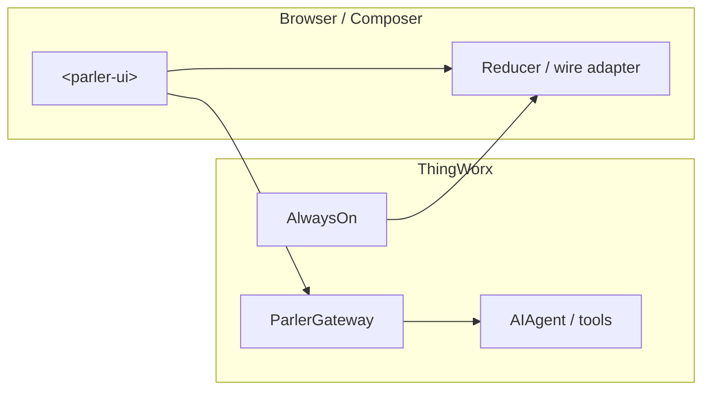

# Architecture

## Product intent

- **ThingWorx–first:** The shipped UI is **`parler-ui`** (`<parler-ui>`) inside **`parler-ui-widget`**. Chat transport is **AlwaysOn** and platform services — see **`agent-alwayson.md`** (this folder).
- **No in-repo LLM server:** **Agent loop, tools, and chart emission** live in **`parler-agent/`** (Java extension) on the platform.
- **Local utilities:** **`test_scripts/`** + **`uv`** expose optional **`reset-dev`** / **`import-dev`** helpers (see repo root **`pyproject.toml`**).

## Overview

## `parler-ui/` (Lit component)

| Path | Role |
|------|------|
| `parler-ui.js` | Custom element + composer |
| `lib/chatSession.js` | `ChatUiState` reducer |
| `lib/wireAdapter.js` | Wire JSON → UI events |
| `lib/types.js` | JSDoc shapes (`ChartBlock`, etc.) |
| `lib/alwaysOn*.js` | Bind, ping, Parler client |
| `components/chart-draw.js` | D3 rendering of `ChartBlock` |
| `styles/parler-ui.css` | Theme tokens |

See **[`UI_CLIENT_PROTOCOL.md`](../../CONTRACTS/UI_CLIENT_PROTOCOL.md)** for wire vs UI split.

## `parler-ui-widget/`

Extension metadata, **`npm run sync`** copy of built **`parler-ui`**, **mub** packaging — **`parler-ui-widget/README.md`**.

## Documentation map

Paths below are correct when browsing from **`docs/architecture/`** (e.g. on GitHub).

| Doc | Content |
|-----|---------|
| [`README.md`](../../README.md) | Build entrypoints and contributing |
| [`API_CONTRACT.md`](../../CONTRACTS/API_CONTRACT.md) | Streaming wire JSON |
| [`CHART_CONTRACT.md`](../../CONTRACTS/CHART_CONTRACT.md) | `ChartBlock` + `chart` frame |
| [`UI_CLIENT_PROTOCOL.md`](../../CONTRACTS/UI_CLIENT_PROTOCOL.md) | UI state vs transport |
| [`CONTRACT_VERSION.md`](../../CONTRACTS/CONTRACT_VERSION.md) | Normative bundle version |
| [`agent-alwayson.md`](./agent-alwayson.md) | ThingWorx AlwaysOn profile |
| [`docs/ui/ai-parler-design.md`](../ui/ai-parler-design.md) | Widget / `<parler-ui>` product design |
| [`docs/agent/`](../agent/) | Java extension deep docs |
