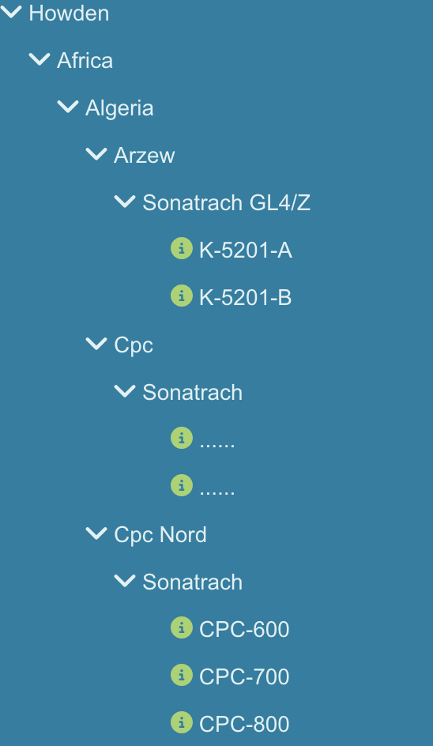

# Entity hierarchy and Parler

**Status:** Architecture note (not a normative contract; tool fields are normative in **`CONTRACTS/API_CONTRACT.md`**).

**Framing:** **Taxonomy** and **Hierarchy** are two **separate, first-class, orthogonal** tracks. A typical analysis flow is **narrow by hierarchy first, then run taxonomy queries within that scope**.

**Type surface:** Structured **`identity-types.json`** and optional **`type-taxonomy.md`** → **`docs/agent/AGENT-TAXONOMY.md`**, **`CONTRACTS/AGENT_TAXONOMY_RENDERING.md`**, **`CONTRACTS/TAXONOMY_RESOLVER.md`**. Contract changes ship in the same change as code and a bump of **`CONTRACTS/CONTRACT_VERSION.md`**.

**`idKind` enum (v1):** This document is the **authoritative source for allowed `idKind` values and `UNSUPPORTED_ID_KIND` semantics**; host JSON and **`docs/architecture/host-context.md`** reference this file only and do not duplicate the list.

---

## 1. ThingWorx working assumption

On a single **Entity**, **Property / Service / Event / Subscription** names **must not** collide. There is no “two Description fields compete for precedence” style of branching.

---

## 2. Two tracks

| Track | Question | Typical ThingWorx anchor |
|------|----------|---------------------------|
| **Taxonomy** | **What kind of asset is this**, templates/shapes, **CriticalProperties**, synonyms | **`identity-types.json`** + built-in resolver tools |
| **Hierarchy** | **Where the instance sits in a tree**, subtrees, rollup | Network, parent/child Things, relationship tables, Site, etc. |

**`CriticalProperties`** only drives **which columns appear first in results**; it does **not** define hierarchy resolution.

---

## 3. Context and prompt

- **Skeleton / full-tree topology:** **Not** included in LLM-visible context; the **Agent JVM** may cache a skeleton **for tool implementation only** (performance, fewer repeated platform calls). **LLM-visible** subtree membership, node lists, and path details **must** arrive only via **tool results** or **`cacheId` / LARGE** paths. **Do not** silently splice skeleton cache into the prompt to bypass tool-based rules.  
- **System prefix:** Only **very short, stable** hierarchy **meta** is allowed (**no** concrete node-name examples; **do not** narrate the UI’s current scope body—scope data is side-channel per **`host-context.md`**); **target cap ≤ 200 tokens** (tunable, must be auditable).  
- **Subtree membership / node lists / expand row sets:** Small results as **INLINE tool payloads**; above the INLINE threshold, **require LARGE + `cacheId`** (same idea as **`query_entities*`** and **`CONTRACTS/TABULAR_INSIGHT.md`**).

---

## 4. Working model

**Nodes:** **`ThingName`** + **`DisplayName`**. **Edges:** At least a four-tuple (parent/child keys and display).

**Three steps:** (1) Load the **network skeleton** (not the full set of related business Things per node); (2) **Resolve** (natural language → **`id` + `idKind`** + disambiguation); (3) **Expand** (bounded **`thingNames[]` / `cacheId`** + **`hasMore`** + stable sort, **SecurityContext**).

**`idKind` (v1):** Only **`"Thing"`**; any other value → **`UNSUPPORTED_ID_KIND`** (exact literals per **`CONTRACTS/API_CONTRACT.md`**).

**Invalid explicit hierarchy scope** (deleted node, or entity not visible to the current user): **Must** surface as an **explicit error** when the scope was supplied as a tool argument such as **`hierarchyNodeName`** / **`intersectThingNames`**; **do not** silently fall back to pure NL resolution so the user believes scope still applies. Host Context v2 itself is rendered prompt guidance only; it does not perform server-side tool-argument injection.

---

## 5. Error semantics, permissions, and platform

**Invalid / invisible scope:** Use an **explicit error path**; hierarchy errors **per contract** propagate to UI / LLM-visible payloads.

**No permission vs not found:** **Same** user-facing feeling and outward behavior; **do not** split into another user-perceivable branch at the product layer. The Parler Agent focuses on **DataInsight**, **not** a coding assistant; ThingWorx on common paths **often cannot reliably distinguish** “does not exist” from “not visible to the current principal”, so we expose **one unified user-visible story** (error codes per **`CONTRACTS/API_CONTRACT.md`**; implementation may map to a single code such as **`NOT_FOUND`**).

**Error code inventory:** The **full set of hierarchy-related `code` values** lives in **`CONTRACTS/API_CONTRACT.md`**. This document only sets **user-visible semantic intent** (including **`UNSUPPORTED_ID_KIND`** and other **`idKind`-related intent**); it does **not** maintain a second code table in parallel with the contract.

**ThingWorx inputs (whether permission / visibility are modeled):** Coding and code-review conventions are in **`docs/agent/AGENT-CONTEXT.md` §5.3.1** (this document does not expand SDK signature details).

---

## 6. Result intersection

**Definition:** Intersect the candidate row set from **`query_entities`** / **`query_entities_by_taxonomy`** with the bounded expand **Thing name set** **B** (**∩**).

**Intersection result envelope:** **Prefer reusing** existing **list-class** tool fields and truncation semantics from **`query_entities*`**; do **not** invent a separate list shape. Intersection is a **scope-shrinking layer**, not a new tool family. **New or differing fields** (e.g. **`preIntersectMatchCount`**, **`intersectedRowCount`**, **`expandHasMore`**, **`queryHasMore`**) are defined **only in `CONTRACTS/API_CONTRACT.md`** in the intersection / list-class sections; this document does not list the full field table.

### 6.1 Expand and Mashup

- **Inputs:** **`id` + `idKind`** (and depth, etc.). Host **`context`** hierarchy fields participate in **rendered prompt** only (see **`host-context.md`**); resolve/expand for tools uses explicit **`hierarchyNodeName`** or **`intersectThingNames`** per **`CONTRACTS/API_CONTRACT.md`**.  
- **`path` (`string[]`, host payload):** **Not** passed into resolve/expand **inputs**; for **UI breadcrumbs** and **LLM-visible summaries** only.  
- **Thing names:** Expand, QIT, and intersection all keep **`name`’s UTF-8 byte sequence unchanged** (**no** `toLowerCase` or other folding at the tool layer); **intersection compares with byte `equals`**—names that differ only by case are different entities. If the platform matches case-insensitively on some path, the returned Thing name must still flow through the tool chain **in the platform’s stored casing**.  
- **Tool parameters / JSON field definitions:** **`CONTRACTS/API_CONTRACT.md`** § **`query_entities` / `query_entities_by_taxonomy` — expand intersect** (**`intersectThingNames`**, **`preIntersectMatchCount`**, **`intersectedRowCount`**, **`queryHasMore`**, **`expandHasMore`**, **`hasMore`** = OR; see §6.4).

### 6.2 `query_entities` intersection

Intersect the **QIT** row set with set **B** on **`name`**.

### 6.3 `query_entities_by_taxonomy` intersection

Intersect **`rootEntityList`** with **B** on **`name`**.

### 6.4 Two-sided truncation, counts, and `hasMore`

When **B′⊆B** and **A′⊆A**, **A′∩B′** need not equal **A∩B**; the intersection is the intersection of **what each side has returned so far**.

- **`hasMore`:** **`hasMore` = Boolean(`expandHasMore`) OR Boolean(`queryHasMore`)`**. If a side **did not run**, that side’s **`*HasMore` = `false`** (does not contribute “more behind”). If a side **failed**, that side’s **`*HasMore` = `null`** (treat as **`false`** for OR; logs may distinguish).  
- **Counts (must be defined in `API_CONTRACT`; do not silently reuse old `totalCount` semantics):** Pre-intersection hit count **`preIntersectMatchCount`** (**`query_entities`** and **`query_entities_by_taxonomy`** **share** the field name; values are per-tool projection); post-intersection row count **`intersectedRowCount`**.

### 6.5 Boundary with host documentation

- **`host-context.md`:** **`key + context`**, registered templates, rendered prompt (advisory scope for the LLM; **no** server-side tool auto-binding).
- **This document:** **`id` + `idKind`**, resolve/expand, intersection, Network/description.

---

## 7. Network services

The hierarchy is read through **five overridable services** on the AgentThing. **Normative service names, parameters, row-count assumptions, and boundary vs existing application JavaScript** are in **`docs/architecture/hierarchy-network-services.md`**.

| Capability | Meaning | Service |
|------------|---------|---------|
| **Related Things** | Business Things attached at a node and its subtree | **`GetAssetList`** |
| **Child network nodes** | Immediate child node list | **`GetChildNodes`** |
| **Resolve / list nodes** | Name fragment → node id; flat node list | **`ResolveNetworkID`**, **`GetFlattenNameDescription`** |
| **Root** | Root node of the Network | **`GetRootNode`** |

The agent calls them through the permission-checked platform service entry, so the **effective** (overridden) implementation runs.

### 7.1 Five overridable service surfaces

**`GetFlattenNameDescription`**, **`ResolveNetworkID`**, **`GetRootNode`**, **`GetAssetList`**, **`GetChildNodes`** — see **`docs/architecture/hierarchy-network-services.md`**; orchestration with **`query_entities*`** and **`intersectThingNames`** and **empty results** is in the same doc **§6**. An application **overrides** these services on its own Thing to supply its hierarchy.

---

## 8. Network name and description: supplied by the services; LLM does not participate

Parler has **no** Network-name or description-property configuration of its own. Which Network is used, and what description text a node or asset carries, is decided by the application's implementation of the five services (§7). **The LLM** must not supply these values via tools; it only passes a node id or name fragment (**`hierarchyNodeId`** / **`hierarchyNodeName`**) per **`CONTRACTS/API_CONTRACT.md`**.

**Multiple root Networks:** selected via rendered host context + explicit tool args (**`host-context.md`**).

---

## 9. Child nodes vs related Things

### 9.1 Child nodes

**`GetChildNodes`** returns the **immediate** children of one node as **`HierarchyNode_DS`** rows (**`id`**, **`name`**) with no paging parameter; ordering and any paging are up to the override (**`hierarchy-network-services.md`** §3.5).

### 9.2 Related Things

**EntityList (`name` + `description`)** from **`GetAssetList`**; when used for intersection, the agent caps the name set at **5000** (**`INTERSECT_LIST_TOO_LARGE`**). Tool results follow the **`query_entities*`** and **`CONTRACTS/API_CONTRACT.md`**, **`CONTRACTS/TABULAR_INSIGHT.md`** **list-class / `cacheId`** rules.

---

## 10. Mashup host background

**Authoritative reference:** **`docs/architecture/host-context.md`** (rendered prompt); tool intersect semantics in **`CONTRACTS/API_CONTRACT.md`**.

---

## 11. Non-goals

Network **version/fingerprint**; LLM switching Network/description; bulk **`thingNames[]`** arguments on other built-in tools.
