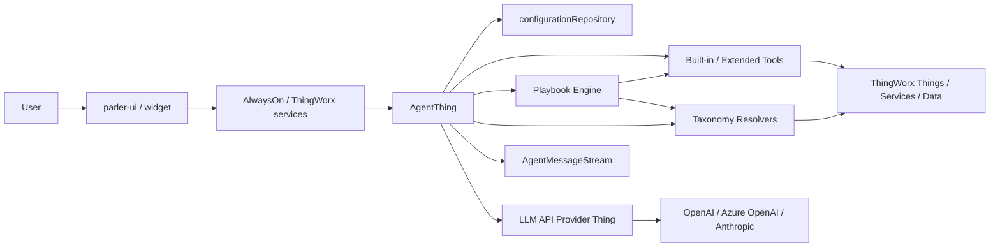
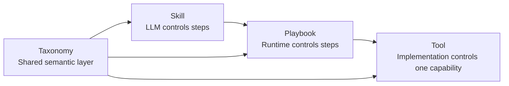
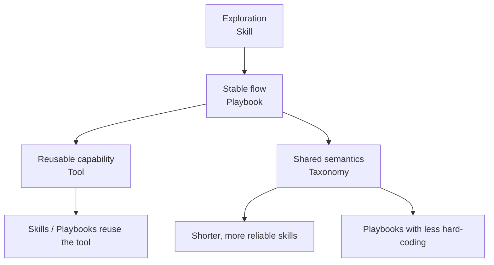
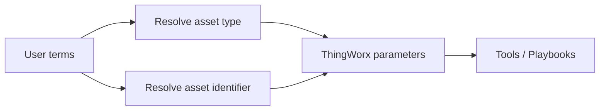
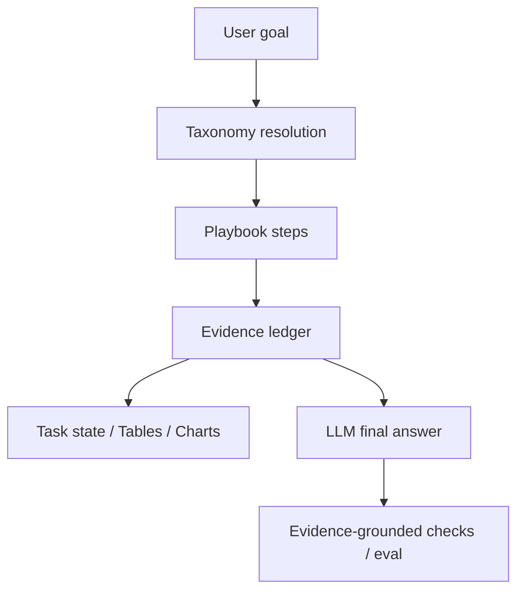
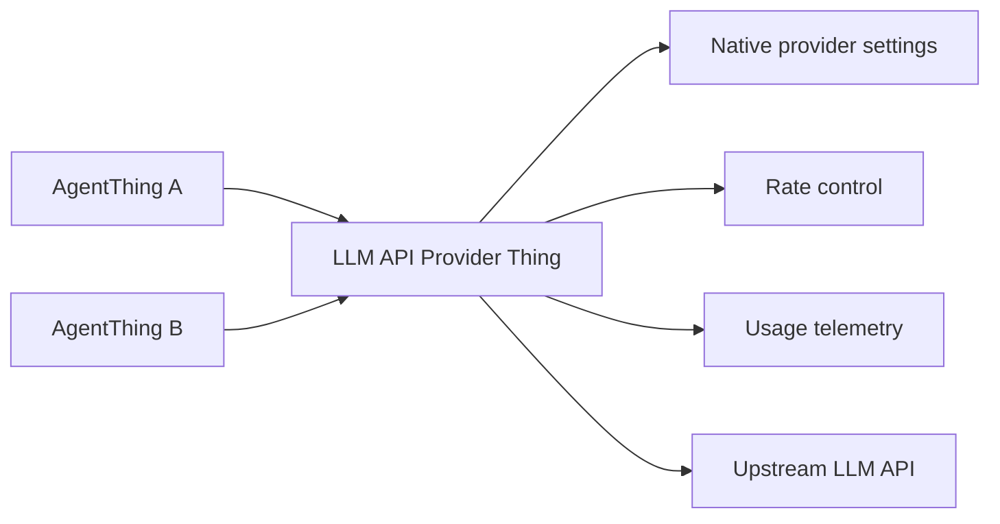

# Parler product architecture, principles and extension model

Audience: ThingWorx solution architects and application developers.
Scope: product architecture, concept boundaries and extension mechanisms. This is an orientation document; it is not
a wire contract (see `CONTRACTS/`) and not an implementation specification.

## 1. What Parler is

Parler is a ThingWorx-first industrial AI agent. It is not a standalone API server, and it is not a chatbot that
relies only on a prompt.

Its goal:

> Let users reach the assets, hierarchy, properties, alerts, history, services, documents and business processes of a
> ThingWorx application in natural language, safely, traceably and extensibly.

It has three parts:

- **UI / widget:** `parler-ui` and `parler-ui-widget` provide the chat window, charts, tables, task state, copy and
  print.
- **Agent extension:** `parler-agent` runs inside the ThingWorx JVM and owns tools, Playbooks, taxonomy, permissions,
  HITL, LLM calls and history persistence.
- **ThingWorx application:** the Things, ThingTemplates, ThingShapes, DataTables, Streams, ValueStreams, services,
  Networks, documents and business data of the application Parler is embedded in.

A central design principle:

```text
The LLM understands, suggests and summarizes.
ThingWorx and the Java runtime decide permissions, tool execution, data boundaries, audit and evidence.
```

## 2. Product boundaries

Parler does:

- turn user intent into executable ThingWorx queries or business processes;
- organize multi-step tool calls into a process that is visible, diagnosable and testable;
- present results as natural language, tables, charts and exportable content;
- manage LLM providers, rate control, prompt/cache telemetry and conversation history;
- offer customer-extensible skills, tools, Playbooks and taxonomy configuration.

Parler does not:

- replace the ThingWorx permission model;
- bypass ThingWorx service, property or entity permissions;
- make final security decisions on the LLM side;
- put all application knowledge into the system prompt;
- generate execution plans dynamically (there is no planner; multi-step work is either LLM-driven through skills
  and tools or runtime-driven through Playbooks);
- resume an unfinished multi-step task after a JVM restart.

## 3. High-level architecture



The main runtime path:

1. The user types a question in the UI.
2. The `AgentThing` loads the conversation, Host Context, taxonomy, skills, tools and Playbooks.
3. The LLM or a slash command triggers a tool, a skill or a Playbook.
4. The Java runtime runs ThingWorx queries and service calls, parses results and applies safety checks.
5. Tool results, Playbook evidence, tables and charts reach the UI.
6. The LLM writes the final answer from the structured evidence.
7. Messages, tool calls, LLM usage and conversation metadata are persisted to `AgentMessageStream` and related tables.

## 4. Key concepts

| Concept | Role |
|---------|------|
| `AgentThing` | A chat-capable agent instance: conversations, tools, Playbooks, taxonomy, provider reference and runtime policy. |
| LLM API Provider Thing | One upstream LLM connection: vendor, API shape, model, deployment, key, rate limits and native parameters. |
| `configurationRepository` | A FileRepository holding customer-configurable skills, tools, Playbooks, policies and taxonomies. |
| Taxonomy | The application semantic layer plus the resolver tools that use it. |
| Resolver | Turns the user's words for an asset type or asset identifier into ThingWorx parameters. |
| Skill | Long-form instructions for the LLM; suited to flexible guidance and non-deterministic flows. |
| Tool | A structured capability the LLM can call; suited to atomic queries, service wrappers and fixed inputs and outputs. |
| Playbook | A multi-step DAG executed by the Parler runtime; suited to stable, visible, testable business processes. |
| Evidence ledger | The structured evidence produced by tools and Playbooks, used by the final answer and by evaluation. |
| Task state | Progress of a Playbook or tool run shown in the UI. |
| HITL | Human-in-the-loop: the user confirms an action before it runs. |
| Rate control | Local, provider-level admission control that avoids costly upstream 429 responses. |
| Conversation | One chat context and its history, identified by `conversationId`. |

## 5. Extension mechanisms: skill, tool, Playbook

The extension mechanisms complement each other. They differ in who controls the steps and in engineering cost.



### 5.1 Skill

A skill is a long instruction document in the repository. It tells the LLM:

- when to use the skill;
- how to approach the query;
- how to interpret tool results;
- when to ask the user a follow-up question;
- when to admit an evidence gap.

Good fit:

- business logic that is still being explored;
- flows with many branches that are not yet worth coding;
- work that needs a lot of explanation and summarization by the LLM;
- quick experiments by an application developer.

Poor fit:

- steps that should be the same every time;
- flows that need many tool rounds, which are slow and run into rate limits;
- flows that need stable UI progress;
- business processes that need strict evaluation.

See [`../agent/CUSTOMIZED-SKILLS.md`](../agent/CUSTOMIZED-SKILLS.md).

### 5.2 Tool

A tool is a structured capability the LLM can call. It is either a Parler built-in tool or an extended tool that the
customer registers in the repository (`/tools/extended_tools.json`).

Good fit:

- atomic queries or operations;
- an existing ThingWorx service that can be wrapped cleanly;
- clear input and output structure;
- capabilities reused by skills, Playbooks or plain conversation.

Poor fit:

- a black box with many internal business steps, where the LLM only sees the final result and not the key evidence;
- work whose intermediate steps must be shown in the UI;
- work where the user needs to understand why each step happened.

See [`../agent/CUSTOMIZED-TOOLS.md`](../agent/CUSTOMIZED-TOOLS.md) and [`../agent/all-tools.md`](../agent/all-tools.md).

### 5.3 Playbook

A Playbook is a multi-step DAG executed by the Parler runtime. The LLM does not decide each tool call; the runtime
executes the definition. Playbooks are packaged under `/playbooks/<id>/playbook.json` in the repository.

Good fit:

- proven, high-value business flows;
- multi-step work with fan-out, aggregation, comparison or diagnosis;
- reducing LLM rounds and rate-control pressure;
- UI task state that shows progress;
- an evidence ledger behind the final answer.

Examples: `cross_region_health`, `cross_asset_pair_health`.

See [`../agent/playbook-engine.md`](../agent/playbook-engine.md).

## 6. Choosing an extension mechanism

| Need | Mechanism | Why |
|------|-----------|-----|
| Try a business Q&A flow quickly | Skill | Cheap and quick to change. |
| Expose an existing ThingWorx service | Tool | Clear inputs and outputs, reusable. |
| A flow that always queries several objects and aggregates | Playbook | Stable, visible, fewer LLM rounds. |
| A natural-language summary at the end | Skill or Playbook | The LLM owns the language, the runtime owns the evidence. |
| Strict intermediate steps and UI progress | Playbook | Task state and evidence ledger fit naturally. |
| Write operations or high-risk services | Tool + HITL / policy | Controlled on the Java side. |
| Tasks that differ every time and need varied tools | Skill | Explore with a skill first, then consolidate. |

The usual progression:



Rules of thumb:

- Use a skill to find the business path.
- When the path is stable and needs many tool calls, turn it into a Playbook.
- When a step is reused, turn it into a tool.
- When several skills or Playbooks keep explaining the same business terms, move those terms into the taxonomy.

## 7. Taxonomy

In Parler:

```text
Taxonomy = application semantic layer + resolver tools
```

The taxonomy is more than a list of asset types. It lets the system understand which asset type the user means,
which Thing an asset identifier refers to, and which properties matter for an asset type.

Repository files:

```text
/taxonomies/identity-types.json
/taxonomies/asset-types.json
/taxonomies/type-taxonomy.md
```

- **`identity-types.json`** is the structured source for the resolver tools. Version 2 is a root object with
  `version: 2` (`entities[]`, `types[]`, representation, membership, optional `queryParent`, identity and display
  properties); version 3 is a root array of identity rules.
- **`asset-types.json`** is a version 3 map of asset types; it loads independently of the identity rules.
- **`type-taxonomy.md`** is optional Markdown included in the stable system prompt. It is visible to the LLM but is
  not the structured source of truth (see `CONTRACTS/AGENT_TAXONOMY_RENDERING.md`).

Field semantics are in [`../agent/AGENT-TAXONOMY.md`](../agent/AGENT-TAXONOMY.md); the resolver JSON is normative in
`CONTRACTS/TAXONOMY_RESOLVER.md`.

### 7.1 Taxonomy resolvers

Resolvers turn the user's words into executable parameters:



Resolver tools: `list_asset_types`, `resolve_asset_type`, `resolve_thing` (with the matching AgentThing services
`ListAssetTypes`, `ResolveAssetType`, `ResolveThing`, and `RefreshTaxonomyCache` for operators). Hierarchy scope is
resolved through the hierarchy Network services (see [`hierarchy-network-services.md`](hierarchy-network-services.md)).

### 7.2 Why the taxonomy is the entry point

Without a taxonomy, skills and Playbooks carry a lot of business knowledge in their text:

- how to resolve `Jet Dryer`;
- whether `ORD JetDryer 02` is a display name or a Thing name;
- which property `speed` means;
- whether `USA` is a hierarchy node or a plain string;
- whether "health" means alerts, current values or history.

Scattered over many skills and Playbooks, that knowledge is hard to maintain and hard to evaluate. With a taxonomy:

- skills get shorter;
- Playbooks need less hard-coding;
- tool parameters are more stable;
- evaluation can test the resolvers directly;
- configuration can be generated and checked against a schema.

## 8. Evidence-aware answers

Parler's answers are based on evidence, not only on model knowledge.

Evidence sources include taxonomy resolver output, current property values, ValueStream and Stream history, alert
summaries and history, DataTable rows, application configuration DataTables, project documentation, domain streams
(recommendations, observations), derived estimates and generic suggestions.

The distinctions that matter:

| Kind | Meaning |
|------|---------|
| Stored fact | A fact explicitly stored in the system. |
| Derived estimate | An estimate derived from other facts, for example a warranty estimate from the connection date plus one year. |
| Documentation-backed fact | A fact from a project manual or document. |
| Runtime observation | A current property value, alert or state. |
| Historical evidence | Past alerts, property history, events. |
| Generic suggestion | General advice; it must not be presented as a fact about the customer's project. |
| Evidence gap | Evidence of a kind that should exist but is not connected or was not found. |

Evidence-aware execution is centered on Playbooks:



Principles:

- Tool results are structured.
- A Playbook records why it chose a scope, asset or property.
- The final answer separates facts, estimates, suggestions and gaps.
- Data that was not read is never reported as confirmed.
- Charts, tables and text come from the same evidence.

See [`../agent/evidence-grounded.md`](../agent/evidence-grounded.md).

## 9. LLM abstraction: Provider Thing and AgentThing

Parler separates the LLM connection from the AgentThing into a Provider Thing.



### 9.1 What the Provider Thing owns

- The API shape: OpenAI Chat v4/v5, Azure OpenAI Chat v4/v5, Anthropic Messages.
- Connection parameters: base URL, deployment, model, API version, native max-token parameters.
- Provider-native options, for example Anthropic `thinkingBudgetTokens` and OpenAI v5 `maxCompletionTokens` and
  `reasoningEffort`.
- Rate-control configuration.
- Base fields for pricing and usage telemetry.
- Upstream HTTP calls, header parsing and the provider request id.

It does not own user conversations, Playbook selection, the tool registry, taxonomy configuration or UI task state.

See [`../agent/llm-api-provider.md`](../agent/llm-api-provider.md).

### 9.2 What the AgentThing owns

- The user chat entry point.
- The system prompt, tool routing guide and conversation replay.
- Loading tools, skills, Playbooks and taxonomy.
- The `configurationRepository`.
- Host Context.
- `conversationId` and `AgentMessageStream`.
- The reference to one Provider Thing.

Several AgentThings can share one Provider, so rate limits aggregate at the real upstream boundary instead of per
AgentThing.

## 10. Caches and rate control

Parler uses several caches with different purposes:

| Cache / compaction | Where | Purpose |
|--------------------|-------|---------|
| Prompt context cache | AgentThing JVM memory | Caches stable system-prompt parts such as the taxonomy and GenericThing keys. |
| Provider prompt cache | Upstream LLM provider | Uses the provider's prompt caching to lower input cost and latency. |
| Replay compaction | Agent runtime | Compacts conversation history and tool results to shorten the context. |
| Large result cache | Agent runtime | Large InfoTables are not sent to the LLM in full; `cacheId` supports paging, summarizing and charting. |
| Taxonomy cache | Agent runtime | Parses repository taxonomy JSON into a normalized semantic model. |
| Browser / UI cache | UI | Rendering state and UX; never a source of facts. |

Rate control sits at the Provider level:

- Each Provider Thing has its own token, request and concurrency gate.
- AgentThings that share a Provider share its local gate.
- Modes: `disabled`, `observe`, `enforce`.
- Bounded wait, so a user task is not simply failed fast.
- Success accounting uses actual provider usage.
- Upstream 429 headers feed back into the gate.

The aim is not to hide 429s but to avoid costly upstream 429s locally. See
[`../agent/rate-control.md`](../agent/rate-control.md).

## 11. `conversationId` and `AgentMessageStream`

`conversationId` is the stable identifier of a Parler conversation. It is neither an HTTP/WebSocket request id nor a
UI session id.

It is used to:

- link the user, assistant and tool rows of one chat;
- restore history after close and reconnect;
- keep conversation continuity;
- reproduce evaluation runs;
- support `ClearConversation` and the history clear marker;
- scope conversation-level behavior such as the large result cache and the last tabular cache mirror.

Typical scope:

```text
conversationId
  -> one logical chat thread
  -> rows in AgentMessageStream
  -> AgentThreadDataTable metadata
  -> in-memory conversation state while the JVM is alive
```

`AgentMessageStream` is the persisted message stream. It records user messages, assistant messages, tool calls and
results, the final answer, prompt/completion token columns, `llmUsageJson`, request and provider telemetry, and the
conversation source.

Boundaries:

- The Stream is the history and audit record, not the only source of runtime state.
- The JVM still holds the current conversation state in memory.
- `ClearConversation` soft-clears history with a time marker instead of deleting rows.
- The evaluation tooling can hard-reset Stream rows; that is test tooling, not product behavior.
- Playbooks do not resume unfinished runs after a JVM restart.

See [`../agent/LLM-PERSISTENCE.md`](../agent/LLM-PERSISTENCE.md) and
[`../agent/conversation-continuity.md`](../agent/conversation-continuity.md).

## 12. Guardrails

For an industrial system, guardrails are more than a stronger system prompt. What matters is control over data sent
to the LLM, tool execution, write operations, audit and what the user finally sees. In the current product,
business data can enter the LLM context, protected by these runtime mechanisms:

- Values of type `PASSWORD` are blocked or masked in tool results, history and logs, and cannot be read or set
  through agent tools (see [`../agent/protection.md`](../agent/protection.md)).
- HITL confirmation before actions that change data.
- The `invoke_service` allow policy (`/policies/invoke_service.json`).
- Large results stay in the result cache; the LLM sees samples and summaries, and `tabulate_cached_result` /
  `summarize_cached_result` compute over the cached rows locally (see
  [`../agent/tool-result-egress-control.md`](../agent/tool-result-egress-control.md)).
- Evidence-grounded answers (§8).

## 13. Adoption path for an application

A ThingWorx application usually adopts Parler in this order:

1. **Create the AgentThing and a Provider Thing:** connect the LLM, set rate control, run basic evaluation prompts.
2. **Set up the `configurationRepository`:** add skills, register the tools you need, configure policies.
3. **Build the taxonomy:** asset types and identity rules.
4. **Explore with skills:** validate the users' questions quickly and find the stable flows.
5. **Turn stable flows into Playbooks:** fewer LLM rounds, UI progress, an evidence ledger.
6. **Turn shared capabilities into tools:** reuse across skills and Playbooks, less duplicated logic.
7. **Build an evaluation suite:** compare models, test the taxonomy resolvers, check answer grounding, and regress
   rate-control and conversation behavior (see [`../agent/agent-evaluation-harness.md`](../agent/agent-evaluation-harness.md)).

## 14. Summary

Parler does not let the LLM control ThingWorx directly:

```text
The ThingWorx runtime owns data, execution, permission, evidence and audit.
The LLM owns language, intent interpretation and bounded reasoning.
The taxonomy makes application semantics explicit.
Playbooks make multi-step work deterministic and visible.
The Provider abstraction makes the LLM connection, caching, usage and rate control manageable.
```
