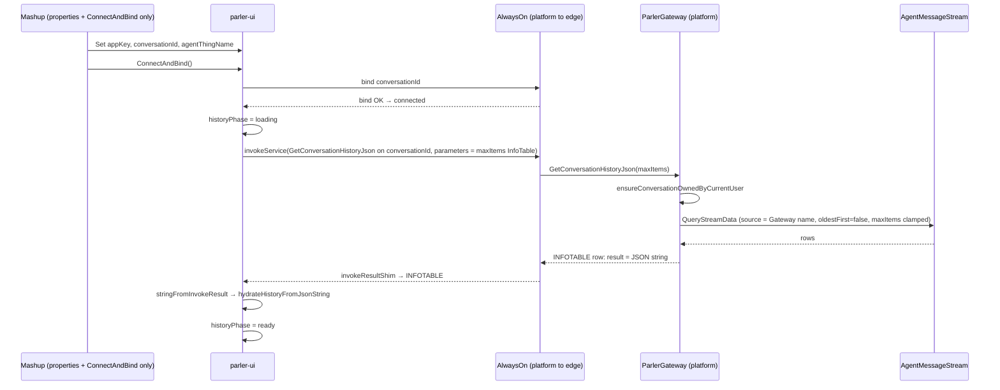

# Load History After Connect (widget-driven)

**Status:** Implemented — **Mashup does not orchestrate history**; **`<parler-ui>` fetches and `hydrate`s on its own after `ConnectAndBind` succeeds**, using **`QueryStreamData`** + **`maxItems`**, and replays final **`markdown`** + **`charts[]`** (no raw tool text).  
**Scope:** In-element **state machine**, **AlwaysOn `invokeService`** calls, **invoke callback unwrapping (same as existing Send path)**, and **Java `ParlerGateway`** service contract; Mashup does not call **`LoadHistoryJson`**.

**Normative split:**

| Topic | Authority |
|-------|-----------|
| **JSON shape** (`ai-parler-history-v1`, row kinds, `charts`) | [`AI_PARLER_HISTORY.md`](./AI_PARLER_HISTORY.md) |
| **Stream row → history row** | [`AGENT_MESSAGE_STREAM_TO_AI_PARLER.md`](./AGENT_MESSAGE_STREAM_TO_AI_PARLER.md) |
| **Wire / UI reducer** (`approvalGate`, reconnect) | [`UI_CLIENT_PROTOCOL.md`](../../CONTRACTS/UI_CLIENT_PROTOCOL.md), [`API_CONTRACT.md`](../../CONTRACTS/API_CONTRACT.md) |
| **Gateway / bind** | [`agent-alwayson.md`](../architecture/agent-alwayson.md) §0.4, [`parler-gateway-design.md`](../agent/parler-gateway-design.md) |
| **This document** | **Widget-side orchestration**, **history state machine**, **uplink invoke and races**, **downstream bootstrap filter rules**, **server export implementation notes** |

**Code touchpoints (current):** [`parler-ui/parler-ui.js`](../../parler-ui/parler-ui.js) (`connectAndBind`, **`stringFromInvokeResult`**), [`parler-ui/lib/alwaysOnParlerClient.js`](../../parler-ui/lib/alwaysOnParlerClient.js) (`invokeService`, **`invokeResultShim`**), [`parler-ui/lib/historyHydrate.js`](../../parler-ui/lib/historyHydrate.js); codec: **`@xudesheng/alwayson-js-codec`** **`stringFromInvokeResult`**; Java: **`ParlerGateway`**, **`AgentMessageStream`**, **`AgentThreadDataTableSupport`**.

---

## 1. Goal

After **AlwaysOn bind succeeds**, automatically load the current session’s **persisted transcript** into the UI; the user **must not Send until first-screen history is ready**, and should see **clear “loading history” feedback**.

**Mashup responsibility shrinks to:** bind **`AppKey` / `ConversationId` / `AgentThingName`** (and optional URL), call **`ConnectAndBind`** (or your wrapper). **No** REST/service history fetch, **no** **`LoadHistoryJson`** (unless kept as **optional advanced API**, §5.5).

---

## 2. Flow

1. Set **`conversationId`** (= transient **`ParlerGateway` Thing name**), **`agentThingName`**, **`appKey`**, etc.  
2. **`ConnectAndBind`** succeeds → transport **`connected`**.  
3. Widget enters **`historyPhase = loading`** (if auto-load enabled, §5.1), **internally** **`invokeService`** **`GetConversationHistoryJson`** on the **bound name** (`conversationId`) (same **entityName** as **`SubmitUserPrompt`**, §7).  
4. **`invokeService` callback** receives **`invokeResultShim`**-wrapped **SDK-style INFOTABLE object**, **not** raw JSON string — per **§5.2.1** use **`stringFromInvokeResult`** to extract **single-column service result**, then **`hydrateHistoryFromJsonString(...)`** (same codec rule as **`SubmitUserPrompt`** **`request_id`** extraction).  
5. On success or controlled failure → **`historyPhase = ready`** (or product variant **`ready_with_history_error`**), **`canSend`** true when semantically ready (still requires draft, not busy, etc.).  
6. **If `session.superseded` arrives during `loading`:** per **§4.4** **invalidate** this history round (**bump epoch**, **forbid** late **`hydrate`**), **`historyPhase`** leaves **`loading`**; **`canSend` must be false until reconnect**.

**Design pillars:**

| Pillar | Meaning |
|--------|---------|
| **Cold snapshot replace** | History remains one-shot **replace**, via existing **`#alignTransportStateForHistoryReplace`** + **`hydrateHistoryFromObject`**. |
| **Bind before history** | Bind first, then fetch history; history **does not** fix connection failures. |
| **Send gated until bootstrap completes** | Enforced by **widget `canSend` + internal phase**, **not** Mashup parallel state. |
| **No resume of live session** | Same as [`UI_CLIENT_PROTOCOL.md`](../../CONTRACTS/UI_CLIENT_PROTOCOL.md) §4; HITL / half-streaming **not** restored from JSON. |
| **Single source of truth for invoke unwrap** | Java service definition and widget unwrapping **fixed** to §5.2.1 / §7.1—avoid “server returns `result` column, client reads raw STRING” → **bind works but history never hydrates**. |
| **Superseded invalidates bootstrap** | **`loading`** + **`session.superseded`** → **bump `historyLoadEpoch`**, **forbid** late **`hydrate`**, **`canSend` false until reconnect** (§4.4); avoid **cold snapshot overwriting** superseded **`error`** and **falsely showing “can chat”**. |

---

## 3. Non-goals

No half-streaming restore, no **`approvalGate`** restore, no incremental merge, no **unspecified** merge of **turn streaming** snapshot with **same-session live delta** in the bootstrap window (§5.6).  
The AlwaysOn-layer **`invokeResultShim`** is unchanged — **history JSON extraction** is layered **on top of** its output.

---

## 4. Widget: internal state machine

### 4.1 States (`historyPhase`)

| Phase | Meaning |
|-------|------|
| **`idle`** | Not connected, or disconnected and load not started. |
| **`loading`** | **`connected`**, **waiting** on `GetConversationHistoryJson` invoke result (or short window after explicit skip). |
| **`ready`** | History applied **or** load skipped **or** failure recorded as thread-level error / empty thread. |

**Optional:** **`loadHistoryOnBind === false`** → go straight to **`ready`** after bind.

### 4.2 Relationship to `connectionStatus`

- **`disconnected` / `connecting`:** reset **`historyPhase`** to **`idle`** (or equivalent), **invalidate** in-flight history invoke callbacks (§6).  
- **`connected`:** if auto-load on, go to **`loading`** and invoke; else **`ready`** directly.

### 4.3 Generation counter (`historyLoadEpoch`)

Tied to bind: **increment on each successful `ConnectAndBind` or explicit `DisconnectAlwaysOn`**. When the history callback arrives, if **`epoch !== epoch at start`**, or **`conversationId`** changed, or **`#twAlwaysOnClient` empty** → **drop result**, do not **`hydrate`**.

**`GetConnectionInfo`:** the post-bind **`ParlerGateway.GetConnectionInfo`** async callback uses the **same** **`historyLoadEpoch`** snapshot as **`GetConversationHistoryJson`** (captured in **`#afterBindStartHistoryBootstrap`**) so late responses are dropped after reconnect, **`session.superseded`**, or transport loss. Normative JSON: **`CONTRACTS/API_CONTRACT.md`** § **`GetConnectionInfo`**; narrative: **`docs/architecture/agent-alwayson.md`** §4.4.

### 4.4 `session.superseded` with history bootstrap in flight (**normative**)

If during **`historyPhase === loading`**, **`ReceiveMessage` still processes `session.superseded` per §5.6** ([`UI_CLIENT_PROTOCOL.md`](../../CONTRACTS/UI_CLIENT_PROTOCOL.md) §4 rule 7), **this history fetch must be invalidated wholesale**—do not rely only on reducer **`error` text**:

1. **Invalidate in-flight invoke immediately:** in the **same turn** that handles that wire, **`historyLoadEpoch++`** (or equivalent **permanent staleness** of `epochAtStart` from when **`GetConversationHistoryJson`** started). Then **late `GetConversationHistoryJson` success callbacks** **must be dropped** under §4.3 checks, **forbidden** to call **`hydrateHistoryFromJsonString`** — otherwise a **cold snapshot overwrites** **`_chatState.error`** after superseded and the UI **looks “can keep chatting”** while **live was taken by another client**.  
2. **End bootstrap:** move **`historyPhase`** from **`loading`** to **`ready`** (or product name **`ready_session_invalid`**) meaning **“no longer waiting on history callback”**; **do not** wait for the late callback to clear the spinner — late callback is **no-op (no hydrate)** + **`requestUpdate`**.  
3. **Send gate:** **`session.superseded`** means **uplink/live under the current bind is invalid**; until the user **succeeds at another `ConnectAndBind`**, **`canSend` must be false** (even if **`historyPhase === ready`**, draft exists, transport still shows connected). **Implementation note:** reference **`parler-ui`** **`canSend` does not read `_chatState.error`** ([`parler-ui.js`](../../parler-ui/parler-ui.js)); **“don’t hydrate” alone is not enough** to block Send after superseded, so the widget keeps a **dedicated flag** (**`#liveSessionInvalidUntilReconnect`**, set on superseded, cleared on **`ConnectAndBind` success**) that **`canSend`** checks.

**Optional consistency:** if **`session.superseded`** arrives **outside** **`historyPhase === loading`** but a **history invoke is still in flight**, also **bump `historyLoadEpoch`** so a **late history response at any time** cannot **erase** superseded semantics.

---

## 5. Widget implementation (`parler-ui`)

### 5.1 Properties and defaults

| Item | Behavior |
|----|------|
| **`LoadHistoryOnBind`** | Boolean, default **`true`**. When **`false`**: after bind, **do not** invoke history service; go **`ready`**. |
| **`HistoryServiceName`** | Optional string, default **`GetConversationHistoryJson`**. |
| **`HistoryMaxItems`** | Number, default **`500`**; passed to **`GetConversationHistoryJson(maxItems)`** / **`QueryStreamData`** (server **clamps 1…20000**). |
| **Copy** | Built-in “Loading history…”, or optional **`HistoryLoadingMessage`**. |

### 5.2 After `connectAndBind` succeeds

After existing **`_setConnectionStatus("connected")`**, clear **`approvalGate`**:

1. Increment **`historyLoadEpoch`**, record **`epochAtStart`**.  
2. If **`!loadHistoryOnBind`**: `historyPhase = ready`, `requestUpdate()`, done.  
3. Else: `historyPhase = loading`, show loading row.  
4. **`#twAlwaysOnClient.invokeService`**: same `entityName` / **`serviceName`** as **`SubmitUserPrompt`**; **`parameters`** = **single column `maxItems`** (platform **`NUMBER`**; in **`InfoTable` JSON** DataShape **`baseType`** must be **`"Number"`** (alwayson-js-codec enum name, **not** `"NUMBER"`), see **`buildGetConversationHistoryJsonParams`** / **`parlerInfotableJson.getConversationHistoryJsonInfoTable`**). **Forbidden** to pass **`parameters: {}`** for **`GetConversationHistoryJson`** (encodes as **`Nothing`** and **server never gets `maxItems`**).  
5. In callback validate **epoch / cid / client** (§4.3); on failure §6. On success §5.2.1 unwrap → **`hydrateHistoryFromJsonString(jsonText)`**; finally **`historyPhase = ready`**.

### 5.2.1 Invoke result unwrapping (**normative**)

**Context:** [`alwaysOnParlerClient.js`](../../parler-ui/lib/alwaysOnParlerClient.js) passes **`invokeResultShim(msg)`** into the **`invokeService` success callback**: platform response shaped as **`{ type: "INFOTABLE", content: … }`** (or fallback **`STRING`/`content`**), **not the same JS type as “Java method returned string reference”**.

**Rules:**

1. **Java:** **`GetConversationHistoryJson`** **`@ThingworxServiceResult`** **must** match **`SubmitUserPrompt`**: result column name **`result`**, **`baseType = STRING`** (§7.1). After platform → edge, **first row `result` column** is the full **`ai-parler-history-v1` JSON text**.  
2. **Widget:** In the history invoke callback, on **`invokeResultShim` output** call **`stringFromInvokeResult(result)`** (**`@xudesheng/alwayson-js-codec`**, **same API as **`SubmitUserPrompt`** `request_id`** — see [`parler-ui.js`](../../parler-ui/parler-ui.js) **`stringFromInvokeResult`**).  
3. **`trim()`** then pass to **`hydrateHistoryFromJsonString`**; empty string → treat as **invoke / business failure** (§6), **do not** treat as silent success.  
4. **Forbidden** to assume the callback’s second arg is **raw `string`** or **unshimmed JSON**; a thin **`historyJsonFromInvokeResult(result)`** (only **`stringFromInvokeResult`**) is fine if **semantics match above**.  
5. **Synchronous throws:** **`stringFromInvokeResult` → `trim` → `hydrateHistoryFromJsonString`** in one **`try/catch`** (or equivalent); any throw → §6 path **`historyPhase = ready`** + thread **`error`**, **must not** leave **`loading`** stuck.

### 5.3 `canSend` extension

On top of existing rules:

- When **`loadHistoryOnBind === true`**, require **`historyPhase === ready`** (**forbid Send** while **loading**).  
- **After `session.superseded`, before successful reconnect:** **`canSend` must be false** (§4.4), regardless of **`historyPhase === ready`**.

### 5.4 UI

- **`historyPhase === loading`:** non-interactive notice.

### 5.5 Relationship to `loadHistoryJson` / `LoadHistoryJson`

- **Default product path:** Mashup **does not** bind **`LoadHistoryJson`**.  
- **Optional:** **`loadHistoryJson`** for manual refresh / debug; only when **`!busy`**, no **`approvalGate`**, and **bump generation** to avoid races.

### 5.6 Downstream (`ReceiveMessage`) during `loading` (**bootstrap filter**)

**Goal:** In the bootstrap window, **do not** mix **turn streaming content** with **cold snapshot** in one reducer semantics; also **do not** swallow **session-level** downstream so the UI still thinks this session **owns live** after **`ready`**.

**Normative classification:**

| While `historyPhase === loading` | Behavior |
|----------------------------------|------|
| **Turn stream / tool-gate body** | **Do not** enter **`applyWireMessage` / reducer** (drop or debug-only log): wire types **`session.ack`**, **`activity`**, **`content.delta`**, **`chart`**, **`done`**, **`error`** (per [`API_CONTRACT.md`](../../CONTRACTS/API_CONTRACT.md) / [`UI_CLIENT_PROTOCOL.md`](../../CONTRACTS/UI_CLIENT_PROTOCOL.md) §2), plus **`approval.required`**, **`approval.resolved`** (before load completes, **do not** open/close gate—avoid fighting snapshot). |
| **`session.superseded`** | **Must still process** — per [`UI_CLIENT_PROTOCOL.md`](../../CONTRACTS/UI_CLIENT_PROTOCOL.md) §4 rule 7: **`applyWireMessage`** (or **`wireToUiEvent` → reducer**), **clear busy / gate, set error copy**. **And** if **`historyPhase === loading`**, **also run §4.4** (**bump `historyLoadEpoch`**, end **`loading`**, **forbid** late history **hydrate**, **forbid Send** until reconnect). |
| **Other `session.*`** | Extend by **whitelist**: frames that **change session ownership or global connection semantics** **must not** be silently dropped because of **`loading`**; **exact types** per **`API_CONTRACT.md`** and **`UI_CLIENT_PROTOCOL.md`**. |

**`conversation_id` filter:** Existing **`parler-ui`** rules to drop **non-session** **`session.superseded`** / **`approval.*`** **still apply** (see **`UI_CLIENT_PROTOCOL.md`** **`<parler-ui>`** section).

**After `ready`:** existing **`#wireBacklog`** / **`#drainWireBacklog`** unchanged.

### 5.7 Files and build

- **`parler-ui.js`:** after `connectAndBind`, **`canSend`**, and the wire entry point hold the bootstrap gate (§5.6).  
- **`lib/historyBootstrap.js`:** history bootstrap helpers (invoke-result unwrap, wire drop rule while loading).

---

## 6. Widget: failure and empty results

- **Invoke failure:** thread-level **`error`** or banner, **`historyPhase = ready`**, **Send allowed**; **avoid** infinite background retries stomping an active chat thread.  
- **Empty `stringFromInvokeResult`:** treat as **failure** (or empty JSON), **do not** hydrate as success.  
- **`stringFromInvokeResult` throws or `hydrateHistoryFromJsonString` throws (rare, must handle):** same as invoke failure — **`#alignTransportStateForHistoryReplace`**, thread **`error`**, **`historyPhase = ready`**, **forbid** stuck **`loading`**.  
- **Empty `rows`:** valid → empty thread + **`ready`**.  
- **Invalid JSON:** existing **`hydrateHistoryFromJsonString`** error path + **`#alignTransportStateForHistoryReplace`** (**still `historyPhase = ready`** if implementation does not throw); if it throws, covered by **`try/catch`** above.

---

## 7. Java: service contract and plan (`parler-agent`)

### 7.1 Service surface (on **`ParlerGateway`**)

Same **session boundary** and **caller identity** as **`SubmitUserPrompt`**:

```text
GetConversationHistoryJson(maxItems?) → STRING   @ThingworxServiceResult(name = "result", baseType = STRING)
```

- **Session id:** **`getName()`** (= **`conversationId`**), same as **`SubmitUserPrompt`**.  
- **Optional `maxItems` (NUMBER):** row cap for **`QueryStreamData`**; **`null` / invalid** → server **default 500**; **clamp 1…20000**.  
- **Output column:** **`result`** — **must match §5.2.1 and `stringFromInvokeResult` INFOTABLE first-column convention**; content is **one JSON string** with root **`format`** (`ai-parler-history-v1`) and **`rows`** ([`AI_PARLER_HISTORY.md`](./AI_PARLER_HISTORY.md)).

**Auth:** **`AgentThreadDataTableSupport.ensureConversationOwnedByCurrentUser(getName(), "[gateway] GetConversationHistoryJson")`** (or equivalent), aligned with **`SubmitUserPrompt`**.

### 7.2 Data: assemble from **`AgentMessageStream`**

- **`AgentMessageStreamAppender`** writes **`AddStreamEntry`**: **`source`** = session key (Gateway name, etc.); **`sourceType`** = **`Thing`** (ThingWorx Stream metadata). **`AgentMessageStreamHistoryExporter`** calls **`QueryStreamData`** on **`AgentMessageStream`** (same as REST **`/Things/AgentMessageStream/Services/QueryStreamData`**): **`source`** = **`getName()`**, **`maxItems`** = service arg (default **500**), **`oldestFirst` = false** so **very long sessions** return the **latest `maxItems` rows**; **reverse in memory** to chronological order then map **`ai-parler-history-v1`**. **Do not** pass **`sourceType`** in the query — returned **`INFOTABLE`** rows are flat **`AgentMessageData`**. Ordering and mapping: [`AGENT_MESSAGE_STREAM_TO_AI_PARLER.md`](./AGENT_MESSAGE_STREAM_TO_AI_PARLER.md).  
- **Mapping (match live Parler bubbles):** segment by **`user`**; each segment → **one** **`kind: assistant`** row: `markdown` **only** the **last** `role=assistant` **`content`** in that segment (final AgentLoop reply; **no** `toolCalls` concat, **no** embedded raw tool text). **`charts[]`** from **`query_property_history`** tool rows that produce numeric chart wire (via **`ParlerChartWireSupport`**), same as live **`type: "chart"`**. If the window truncates mid-segment, segment may start without `user`, replay tail assistant only. **Do not** output **`approvalGate`** / pending **`pending_id`** (§8).

### 7.3 Java modules

| Task | Notes |
|------|------|
| **`ParlerGateway.GetConversationHistoryJson`** | Annotations **`result` / STRING**; ownership; delegate to exporter. |
| **`AgentMessageStreamHistoryExporter`** | **`QueryStreamData`**, **`ObjectMapper`** JSON; **max rows / max JSON chars** (§7.4). |
| **Unit tests** | Mapping and empty Stream; **verify service result InfoTable column `result`**. |
| **Docs** | **`AGENT-CONTEXT.md`** / **`AGENT-ALWAYSON-TWX.md`**; **`metadata.xml`** conventions. |

### 7.4 Safety and capacity

- **Same principal** as chat.  
- **Rate / size** caps.

### 7.5 Boundary with **`AgentThing`**

- **Need not** expose history on **`AgentThing`**; **Gateway** with **`SubmitUserPrompt`** is simplest locus.

---

## 8. HITL

History JSON **does not** restore **`approvalGate`**; expiry/reject as **plain markdown rows** ([`UI_CLIENT_PROTOCOL.md`](../../CONTRACTS/UI_CLIENT_PROTOCOL.md)).

---

## 9. Bootstrap window vs live downstream

- **`loading`:** **turn streaming** frames do not enter reducer; **`session.superseded`** **still processed** (§5.6), triggers §4.4 (bootstrap invalid + **Send** gate until reconnect).  
- **`ready`:** only **live** updates reducer per existing rules.

---

## 10. Sequence diagram (widget-driven)



---

## 11. Accepted trade-offs

| Trade-off | Rationale |
|-----------|-----------|
| History vs **turn stream** isolated during loading | Avoid dual sources of truth; **session-level** frames whitelisted separately. |
| **Session key** still Gateway name; optional **`maxItems`** only caps Stream row count | Matches **`SubmitUserPrompt`** **`conversationId`**; **no** extra identity params. |

---

## 12. Bottom line

Mashup **only connects and sets identity**; **history load** is **`<parler-ui>`** with **state machine + AlwaysOn invoke**; **invoke return** after **`invokeResultShim`** **must use `stringFromInvokeResult` aligned with Java column `result`**; **during bootstrap** **drop turn-stream wire**, **keep `session.superseded`**, and on superseded **bump `historyLoadEpoch`**, **invalidate late history**, **forbid Send until reconnect**; **Java** exports **`ai-parler-history-v1`** on **`ParlerGateway`**.
