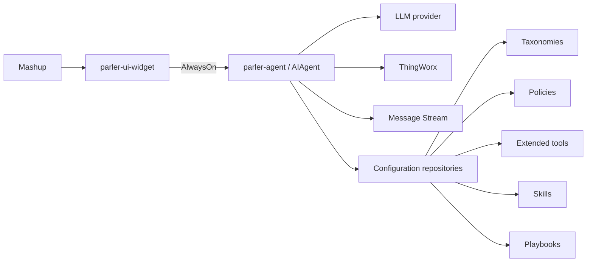

# Day 1 slides: Parler introduction, architecture, and workshop setup

This outline mirrors the Day 1 deck in this folder (`Parler workshop – Day1.pptx`). Day 1 is primarily orientation: what Parler is, how it is designed, where the source and training material live, and how students get their ThingWorx environment ready. Students finish the day with a practical connection check and the first prompt (`who are you`).

## Slide 1 - Title

Title: Parler workshop - Day 1

## Slide 2 - Agenda

Sections:

1. Parler Intro
2. Design Principles
3. Reactive Agent
4. Source and training material
5. Architecture
6. Let's start

## Slide 3 - What Is Parler

Title: Parler

Bullets:

- Parler is an AI agent that runs inside ThingWorx.
- It is delivered as a platform extension.
- It is built to be extended for your application.

Extension points:

- Taxonomy
- Extended tools
- Skills
- Playbooks

## Slide 4 - Design Principles

Title: Design principles

Bullets:

- Trust by construction.
- Numeric series for charts come from platform-backed tool rows, not free-form model guesses.
- Human-in-the-loop (HITL) protects mutating paths.
- Mutating paths can require explicit user approval inside the Parler widget.

## Slide 5 - General Agent Building Approach

Title: Planner vs Reactive

Planner:

- Breaks goals into steps.
- Builds a task plan first.
- Works well for multi-stage tasks.
- Emphasizes coordination and structure.

Reactive:

- Observes and acts continuously.
- Adjusts based on feedback.
- Works well in dynamic environments.
- Emphasizes responsiveness and adaptation.

## Slide 6 - Parler Reactive-First Agent Design

Title: Parler: Reactive-First Agent Design

Core loop:

```text
observe -> validate -> act -> learn from feedback
```

Bullets:

- Acts through a live tool loop, not a full classical planner first.
- Uses preflight gates before tool execution and side effects.
- Validates Thing names, visibility, and canonical targets early.
- Makes tools LLM-friendly with structured, actionable errors.
- Lets the model recover: resolve identity, adjust inputs, retry safely.

## Slide 7 - Evolving Toward Planning

Title: Parler: Evolving Toward Planning

Direction:

```text
start reactive, codify what works, then plan on top of trusted structure
```

Bullets:

- Parler is not anti-planner.
- Planning is introduced where it adds reliability.
- Multi-turn dialogue handles flexible, exploratory tasks.
- Skills guide the LLM with domain-specific reasoning patterns.
- Playbooks turn proven workflows into visible, repeatable execution.
- Planning builds on stable tools, taxonomy, and evidence.

## Slide 8 - Source and Training Material

Title: Source and training material

Product repository:

- Source code of the Parler project (`parler-agent`, `parler-ui`, `parler-ui-widget`).
- Normative contracts under `CONTRACTS/` and design and operations notes under `docs/`.
- Support tooling under `test_scripts/` (for example `uv run parler-collect-live` and `uv run load-file-tree`).

Training material (`training/` in the same repository):

- An mdBook project with the course chapters and appendices.
- Slide outlines, sample data, and workshop exercises.
- Students are encouraged to suggest improvements to the training material.

## Slide 9 - System Architecture

Title: Parler System Architecture

Main components:

- `parler-agent` extension: Java extension for ThingWorx, supporting 9.5 to 10.1.
- `parler-ui-widget`: regular ThingWorx mashup widget that can be embedded in mashups.
- AlwaysOn protocol connects the widget to the agent for the UI experience.
- LLM provider connects the agent to the selected model.
- Message Stream persists conversation evidence.
- Configuration repositories hold taxonomies, policies, extended tools, skills, and playbooks.

UI output types:

- Progress
- Table
- Chart
- Final response

Diagram placeholder:



## Slide 10 - Training Environment Setup

Title: Training environment setup

ThingWorx instance:

- Set up a ThingWorx instance based on the provided template.
- Create an appKey.
- Keep the URL and appKey private; share them only through the channel your instructor designates for diagnostics.

Ask for help:

- Use the class support channel; include the prompt, conversation id, and time (see Appendix K).

## Slide 11 - Let's Start

Title: Let's start

Components to import:

- `parler-agent` extension
- `parler-ui-widget` extension
- `ParlerAgentBasic.xml`

LLM connection:

- Create at least one LLM provider.
- Verify the provider before moving to application-specific configuration.

## Slide 12 - Live Setup and First Prompt

This slide has no visible text; the slot is used for hands-on setup and connection verification.

Day 1 completion point:

- Confirm extensions are imported.
- Confirm the basic Agent project is imported.
- Confirm at least one LLM provider is configured.
- Confirm the widget connects to the AgentThing.
- Send the first prompt:

```text
who are you
```

Day 2 starts from this baseline: connection and the first generic prompt are already done.
