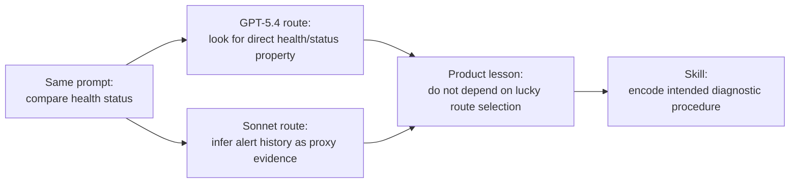
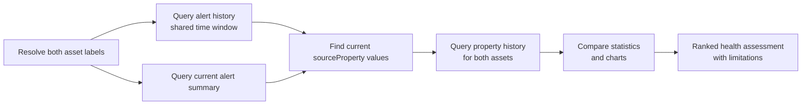

# Day 2 slides: From first working prompts to the first skill

Day 1 covered Parler orientation, design principles, the reactive-first architecture, repository roles, initial environment setup, widget connection, and the first successful prompt (`who are you`). Day 2 starts from that working chat baseline: students should not spend the session reconnecting unless something broke. The main scope is application vocabulary, built-in tools, model-route differences, and the first skill.

## Slide 1 - Goal

Title: From working chat to the first reusable skill

Bullets:

- Confirm the Day 1 chat baseline is still working.
- Add identity and asset-type taxonomy so labels resolve cleanly.
- Use built-in tools for a real business investigation.
- Compare how models route the same vague health prompt differently.
- Capture the repeated route as the first skill.

## Slide 2 - Day 1 Recap

Bullets:

- Parler runs inside ThingWorx as an extension.
- The widget talks to the agent over AlwaysOn.
- The agent is reactive-first: observe, validate, act, recover.
- Configuration repositories hold taxonomy, tools, policies, skills, and playbooks.
- Students completed connection testing and the first `who are you` prompt.

## Slide 3 - Starting Baseline

Day 2 assumes:

- `parler-agent` extension imported.
- `parler-ui-widget` extension imported.
- `ParlerAgentBasic.xml` imported.
- At least one LLM provider exists and `TestConnection` passes.
- AgentThing points to the provider.
- Mashup containing the Parler widget is open.
- Transport is connected.
- `who are you` already succeeded on Day 1.

Use this slide only as a quick health check, not as the main exercise.

- `[screenshot: widget connected with agent/widget versions]`

## Slide 4 - What Day 1 Proved and Did Not Prove

Day 1 proved:

- The extension import path works.
- The widget can connect to the AgentThing.
- The LLM provider path works.
- The UI stream can carry a basic response.

Day 1 did not prove:

- The model understands customer asset labels.
- The model knows canonical Thing names.
- The model knows which properties matter for a business question.
- The model can reliably choose a multi-step diagnostic route.

Teaching line:

```text
A connected chat is not yet an application-aware agent.
```

## Slide 5 - Controlled Failure: Human Label vs Thing Name

Prompt:

```text
For MUC JetDryer 01, what is the current dryingSpeed?
```

Teaching points:

- Users speak in labels, aliases, serials, and short names.
- ThingWorx APIs need canonical Thing names and exact property names.
- The model should not guess the Thing name.
- The fix is not a better prompt; the fix is repository-backed identity semantics.

Screenshot placeholder:

`[screenshot: failed or ambiguous Thing resolution]`

## Slide 6 - Identity Taxonomy

Title: `identity-types.json`

Bullets:

- Defines how user-facing identifiers map to concrete Things.
- Used by `resolve_thing` before tools that require canonical Thing names.
- Should return one canonical Thing or force disambiguation.
- Keeps prompts natural while keeping tool calls exact.

Code placeholder:

`[snippet: identity-types.json for JetDryer / Contacting labels]`

## Slide 7 - Asset Type Taxonomy

Title: `asset-types.json`

Bullets:

- Defines application asset classes such as JetDryer, Contacting, Cutting, or work unit types.
- Maps business classes to ThingShapes or ThingTemplates.
- Used by `resolve_asset_type` and `query_entities_by_taxonomy`.
- Critical properties make useful columns appear first.

Code placeholder:

`[snippet: asset-types.json for the workshop dataset]`

## Slide 8 - Refresh and Retest

Steps:

- Upload taxonomy files under `/taxonomies/` in `configurationRepository`.
- Run repository validation when available.
- Refresh taxonomy / prompt context.
- Start a clean conversation or cut off the old failed message.
- Re-run the same prompt.

Screenshot placeholders:

- `[screenshot: taxonomy files in FileRepository]`
- `[screenshot: RefreshTaxonomyCache or prompt refresh]`
- `[screenshot: successful MUC JetDryer dryingSpeed answer]`

## Slide 9 - Built-In Tool Surface

Bullets:

- Tool count varies with loaded skills, playbooks, and extended tools (~22 built-ins with a loaded skill catalog on ship baseline **0.1.206** / **0.1.89**).
- `get_agent_skill` appears only when a skill catalog is loaded.
- `start_playbook` appears only when a playbook catalog is loaded; loaded playbook ids are listed in the per-turn catalog and in the dynamic `start_playbook` schema (see Chapter **12**).
- Legacy discovery tools are executor-only by default.
- `parallel` / `multi_tool_use.parallel` is not a Parler tool; treat it as a model hallucination.

Reference:

`[appendix: Built-in tools]`

## Slide 10 - Tool Categories We Need Today

Bullets:

- Identity resolution: `resolve_thing`
- Current values: `get_property_values`
- Alert snapshot: `query_alert_summary` (`thingNames[]` in 0.1.202+)
- Alert timeline: `query_alert_history`
- Property trend: `query_property_history`
- Charts: chart-capable property-history calls and chart artifacts

Teaching line:

```text
Health is not a property lookup. Health is an evidence-backed assessment.
```

## Slide 11 - Built-In-Only Business Task

Prompt:

```text
please compare the health status between ORD Contacting 02 and ORD Contacting 01
```

Expected learning:

- This is intentionally vague.
- GPT-5.4 may stop after discovering no direct health/status property.
- Sonnet may infer that alert history is a useful health proxy and call alert tools by itself.
- Both outcomes are useful: model behavior differs, so the business route should not depend on luck.

Screenshot placeholders:

- `[screenshot: GPT-5.4 stops at no direct health property]`
- `[optional screenshot: Sonnet infers alert history route]`

## Slide 12 - Why Model Difference Matters

Claim:

```text
A lucky tool route is not a product contract.
```

Bullets:

- The same prompt can produce different tool paths across models.
- One model may search for a literal property.
- Another model may infer a diagnostic route from tool names.
- Different context, loaded skills, or prior turns can change the route again.
- Application developers should encode the intended route in skills and playbooks.

Diagram:



## Slide 13 - Multi-Turn Route Without a Skill

Prompt sequence:

```text
please compare the health status between ORD Contacting 02 and ORD Contacting 01

How did their alert histories compare over the past 24 hours?

How do their current alert summaries compare?

Which two properties generated the most alerts?

Show the past 24-hour trends for those two properties on both assets as line charts.

Statistically compare those trends over the past 24 hours.

Based on the above, summarize their health condition.
```

Screenshot placeholders:

- `[screenshot: alert history comparison]`
- `[screenshot: alert summary comparison]`
- `[screenshot: trend charts]`
- `[screenshot: final ranked assessment]`

## Slide 14 - The Route We Want to Capture

Route:

```text
resolve both asset labels
  -> query alert history over one shared time window
  -> query current alert summary
  -> identify current alert-driving sourceProperty values
  -> query property history for those properties on both assets
  -> compare statistics and charts
  -> produce ranked health assessment with limitations
```

Teaching points:

- The route is application knowledge.
- The user should not memorize seven prompts.
- The model should not rediscover this route every time.
- A skill is the smallest repository-backed mechanism for capturing it.

Diagram:



## Slide 15 - Skill Is Not a Tool

| Item | Meaning |
|------|---------|
| Tool | Callable operation exposed by Parler. |
| Tool result | Evidence returned by ThingWorx/runtime. |
| Skill | Markdown guidance for when and how the model should use tools. |
| Playbook | Deterministic DAG executed by the runtime. |

Teaching line:

```text
A skill changes the model's procedure, not the platform API surface.
```

## Slide 16 - First Skill Shape

Skill: `asset_pair_health`

Bullets:

- Built-ins only.
- Accepts two asset labels without requiring asset type.
- Defaults time window to 24h unless the user says otherwise.
- Resolves both Things before evidence calls.
- Uses alert history, current summary, current alert source properties, and trends.
- Final answer states evidence and limitations.

Code placeholder:

`[snippet: SKILL.md front matter and route]`

## Slide 17 - Upload, Validate, Refresh

Steps:

- Upload to `/skills/asset_pair_health/SKILL.md`.
- Run `ValidateAgentConfigurationRepository`.
- Run `RefreshPromptContextCache`.
- Start a new conversation or run a clean test turn.

Screenshot placeholders:

- `[screenshot: FileRepository skill path]`
- `[screenshot: validation result]`
- `[screenshot: prompt context refresh]`

## Slide 18 - Retest With Skill

Prompt:

```text
/asset_pair_health Compare ORD Contacting 02 and ORD Contacting 01 for the last 24 hours.
```

Validation questions:

- Did the model load the skill?
- Did the route become more stable?
- Did it resolve canonical Thing names?
- Did it produce alert evidence, trend evidence, and a ranked assessment?
- Did it state missing data instead of inventing facts?

Screenshot placeholder:

`[screenshot: successful skill-driven health comparison]`

## Slide 19 - Day 2 Takeaway

Bullets:

- Day 1 explained Parler's architecture; Day 2 makes it practical.
- Taxonomy turns human labels into stable tool inputs.
- Built-ins can answer meaningful app questions.
- Multi-step tool use is fragile when left as prompt habit.
- Model differences are expected; skills make the intended route explicit.
- The first customization artifact is a skill, not Java code.
