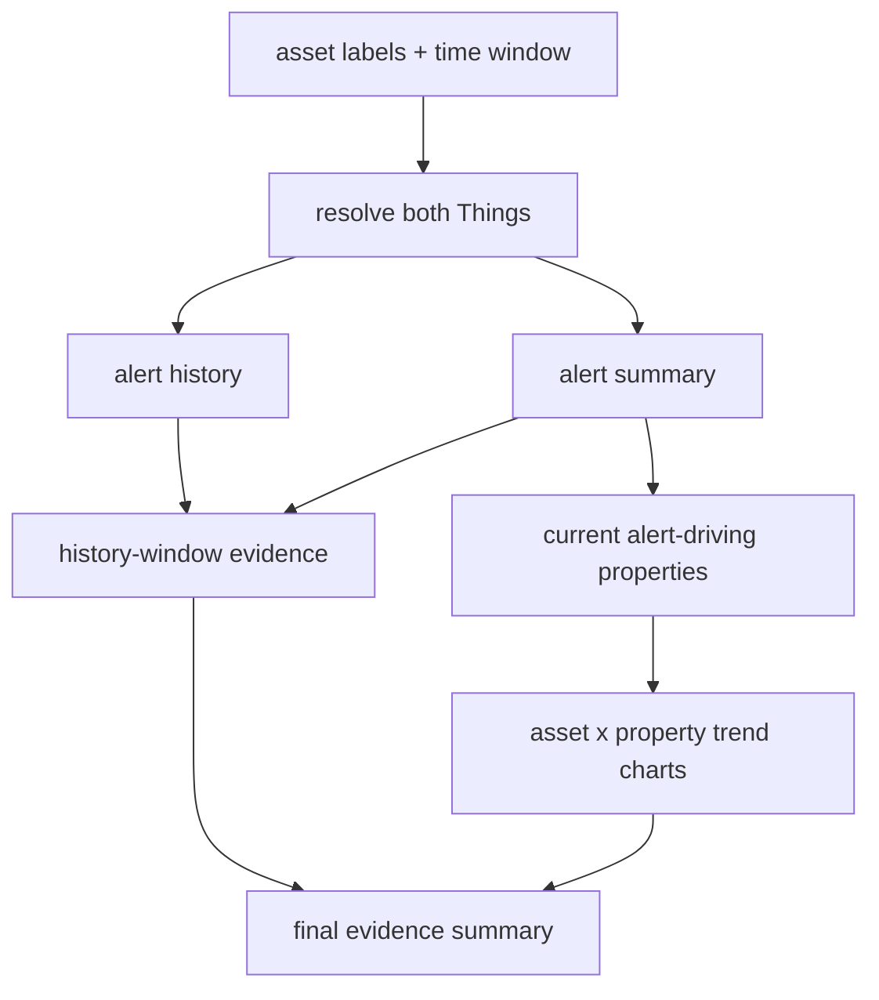

# Day 3 slides: Playbooks, extended tools, and policies

## Slide 1 - Goal

Title: From guided workflow to deterministic workflow

Bullets:

- Promote the Day 2 skill route into a playbook
- Understand DAG execution
- Upload and refresh one active playbook
- Then expose app-specific services with extended tools
- Explain why generic service calls may require approval

## Slide 2 - Why Playbook After Skill

Bullets:

- The skill made the health comparison repeatable
- The model still chooses each tool call
- Stable routes deserve runtime execution
- Playbook keeps the route fixed and lets the LLM summarize evidence

## Slide 3 - Skill vs Playbook

| Question | Skill | Playbook |
|----------|-------|----------|
| Who plans steps? | LLM with guidance | runtime DAG |
| Who resolves dependencies? | LLM | runtime |
| Best for | flexible procedure | stable workflow |
| Final LLM role | answer from tool results | summarize compact evidence |

## Slide 4 - Health Playbook DAG



## Slide 5 - Day 3 Playbook File

Path:

```text
/playbooks/cross_asset_pair_health/playbook.json
```

Bullets:

- one directory per playbook
- one active `playbook.json`
- no `playbooks-v2` / `playbooks-v3` in the uploaded repository
- refresh after upload

Screenshot placeholder:

`[screenshot: FileRepository playbook path]`

## Slide 6 - Live Playbook Prompt

Prompt:

```text
please compare the health status between ORD Contacting 02 and ORD Contacting 01 over the past 24 hours
```

Expected:

- `start_playbook(cross_asset_pair_health)`
- full labels resolved by `resolve_thing`
- up to four line charts emitted by `query_property_history`; two charts is normal when only one current alert-driving property is selected
- ranked final answer

Screenshot placeholders:

- `[screenshot: task progress]`
- `[screenshot: final answer with charts]`

## Slide 7 - Extended Tools Bridge

Bullets:

- Built-ins cannot cover every application service
- SCPA utilization lives behind ThingWorx services
- Extended tools register those services for the model
- Wrappers reshape mashup-oriented signatures into LLM-friendly calls

## Slide 8 - Mashup Service Is Not Always LLM-Friendly

Bullets:

- Mashup can hold and pass `INFOTABLE`s
- LLM should not construct DataShape-specific tables
- Workshop baseline 0.1.191+ can pass validated derived rows with `$infotable`
- Empty table can mean "nothing", not "all"
- Service names may describe implementation, not user intent

## Slide 9 - Direct or Wrapper

| Shape | Decision |
|-------|----------|
| scalar dates only | direct may be OK |
| machine as `STRING` | wrapper to `THINGNAME` |
| input `INFOTABLE` | wrapper for open chat; `$infotable` in validated playbooks (workshop baseline 0.1.191+) |
| silent `null` result | wrapper with structured status |
| internal pipeline step | consider hiding behind semantic service |

## Slide 10 - SCPA Seven Services

> **Pre-LLM-friendly (Day 3):** underlying ThingWorx **service** inventory for classification — not the Day 4 four-tool upload target (see `day4` Slide 7).

Bullets:

- machine listing
- machine listing with dates
- raw utilization records
- raw utilization records by machine
- aggregate by state
- stats for aggregate data
- aggregate by state over time fence

Screenshot placeholder:

`[screenshot: ThingWorx service list]`

## Slide 11 - Policy and HITL

Bullets:

- `invoke_service` is generic and strict by default
- Parler does not infer read-only behavior from service names
- `/policies/invoke_service.json` allows known calls to bypass HITL
- Missing, invalid, or non-matching policy means approval is required

Screenshot placeholder:

`[screenshot: Confirm service invocation dialog]`

## Slide 12 - Policy Rule Shape

```json
{
  "version": 1,
  "rules": [
    {
      "id": "allow-known-read-service",
      "priority": 100,
      "match": {
        "entityTypes": ["Thing"],
        "entityNames": ["<ThingName>"],
        "serviceNames": ["GetFlattenNameDescription"]
      }
    }
  ]
}
```

## Slide 13 - Day 3 Exercise

Bullets:

- Upload the health playbook
- Run one live playbook prompt
- Pick one SCPA service
- Decide direct vs wrapper
- Write one extended tool entry
- If property meanings live in a DataTable, expose a bounded dictionary lookup
- Add or inspect one `invoke_service` policy rule

## Slide 14 - Day 3 Takeaway

Bullets:

- Skills teach a procedure
- Playbooks execute a stable procedure
- Extended tools expose application capability
- Policies control generic service approval
- Wrappers make capability easier for the LLM to use
