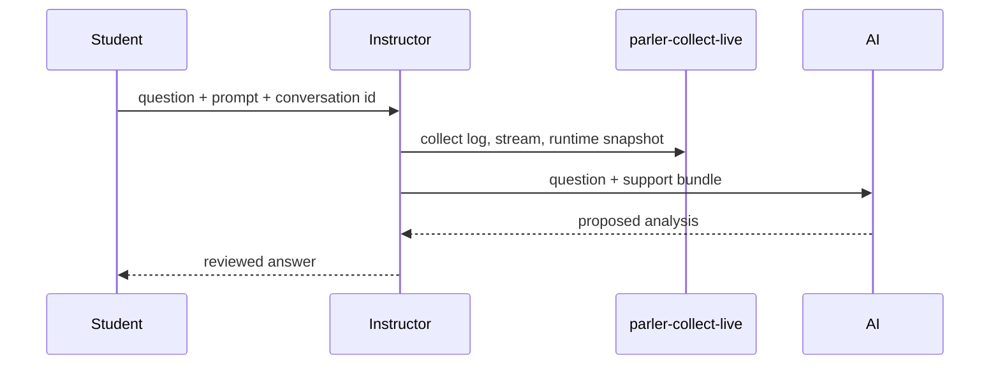

# Day 4 slides: Evidence grounding and workshop support

## Slide 1 - Goal

Title: From useful answers to trustworthy answers

Bullets:

- Observe answer variance after skills
- Add evidence-grounding rules
- Discuss LLM-friendly service design
- Explain how workshop questions and diagnostics are collected

## Slide 2 - Why Evidence Grounding

Class activity:

- Students run the same skill or playbook
- Compare final answers
- Expect wording and emphasis to vary
- Ask: which claims are backed by tool output?

## Slide 3 - Evidence Grounding Rules

Bullets:

- name authoritative tools
- name rows/columns that matter
- state what to do when evidence is missing
- forbid inference from prior prose

Example:

```text
Do not call an asset healthy just because no alert rows were returned.
Say "no alert evidence returned" unless a health metric supports the claim.
```

## Slide 4 - Add Evidence Rules To Skill

Code placeholder:

`[snippet: SKILL.md evidence rules section]`

Retest:

- same prompt
- same tools
- more disciplined final answer

## Slide 5 - Utilization Failure

Example:

```json
{
  "Machines": []
}
```

Bullets:

- Model intended "all machines"
- Service interpreted empty selection
- Final answer became misleading
- Evidence rules can catch the gap, but interface design should remove it

Screenshot placeholder:

`[screenshot: tool result showing null or empty result from Machines=[]]`

## Slide 6 - LLM-Friendly Interface

Bullets:

- design around user intent
- use scalar inputs
- make scope explicit
- keep intermediate `INFOTABLE`s inside the app
- return answer-ready evidence

## Slide 7 - Proposed Four Services

> **Post-LLM-friendly (Day 4 / Chapter 16):** final model-facing tool names — upload target is `workshop/day4/tools/extended_tools.json`.

Bullets:

- `list_utilization_machines`
- `get_utilization_state_summary`
- `get_utilization_records`
- `get_utilization_overview`

Design principle:

> Tool names should match user intent, not internal service lineage.

## Slide 8 - Example Friendly Input

```json
{
  "machineScope": "all",
  "startDate": "2026-06-01T00:00:00Z",
  "endDate": "2026-06-02T00:00:00Z",
  "includeStats": true
}
```

Bullets:

- no raw `Machines` table
- explicit scope
- dates are scalar
- output should already contain percentages and counts

## Slide 9 - Workshop Support

Bullets:

- Students report questions through the class support channel
- Include chapter, prompt, conversation id, time, and extension versions
- For live chat problems, the instructor collects logs and stream rows
- AI-assisted analysis speeds up triage; the instructor reviews the answer



## Slide 10 - Diagnostics Tool

Bullets:

- collects ApplicationLog
- collects AgentMessageStream
- collects AgentThing status/config metadata
- `uv run parler-collect-live -o logs` from this repository
- uses the target server's `DEV_SERVER` and `DEV_KEY`
- output is sensitive internal diagnostics

Screenshot placeholder:

`[screenshot: collection output folder with JSON files]`

## Slide 11 - Final Takeaway

Bullets:

- taxonomy teaches the agent vocabulary
- tools expose bounded operations
- skills teach procedures
- playbooks execute stable workflows
- evidence grounding makes answers trustworthy
- a consistent support workflow keeps workshop feedback actionable
