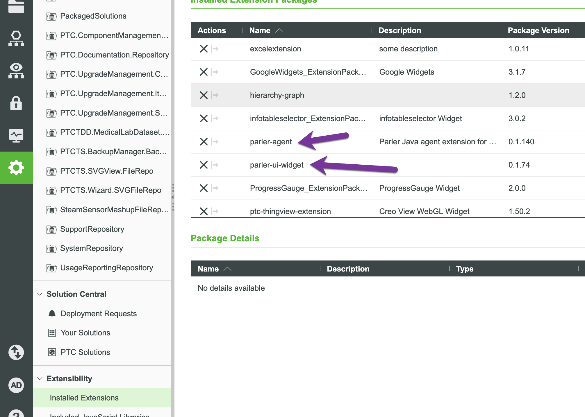
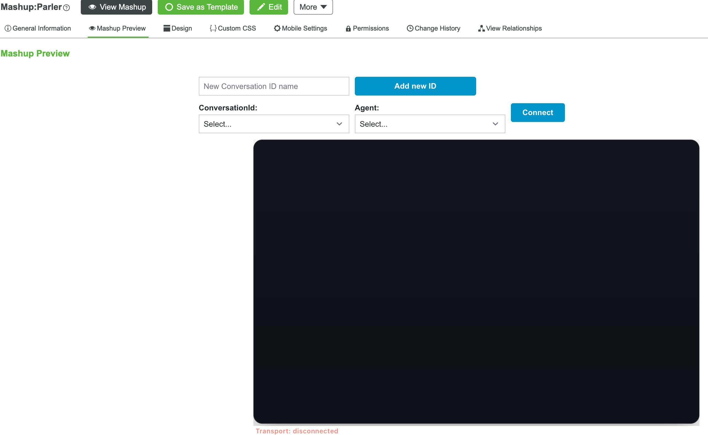

# Import Parler extensions and the sample mashup

## Goal

Install the Parler basics. Every Parler installation needs these three items, whatever application it serves:

1. **`parler-agent`** — the Java ThingWorx extension. It contains the **`AIAgent`** template, **`ParlerGateway`**, the
   LLM Provider templates and the agent implementation.
2. **`parler-ui-widget`** — the Composer widget extension that hosts **`<parler-ui>`**.
3. **`ParlerAgentBasic.xml`** — the base entities: project `ParlerAgentBasic`, the `Parler` and `Parler-embedded`
   mashups, the `Parler_Widget_Connect_Datashape` and `ParlerDefaultAgentThingConfigurationDataShape` DataShapes, and
   the `Parler_helper` and `AgentLlmUsageCalculator` Things (the latter produces LLM usage and cost reports).

All three are attached to each release on the repository's release download page
(`parler-agent-<version>.zip`, `parler-ui-widget-<version>.zip`, `ParlerAgentBasic.xml`). You can also build the two
ZIPs yourself (see *Build artifacts* below) and take [`dev_data/ParlerAgentBasic.xml`](../../dev_data/ParlerAgentBasic.xml)
from this repository.

Import the two extensions **before** `ParlerAgentBasic.xml`: its mashups use the widget, and its entities use the
agent's DataShapes and templates.

### Option A: import in Composer

1. **Import > Extension**: import `parler-agent-<version>.zip`, then `parler-ui-widget-<version>.zip`.
2. **Import > From File > Entities**: import `ParlerAgentBasic.xml`.

### Option B: scripted import with `load.py`

The repository root contains `load.py`, a standalone import tool, and `dev_data/parler-basic.yaml`, an import plan that
downloads the three files from the **latest release** and imports them in the right order.

1. Install [uv](https://docs.astral.sh/uv/) (it runs `load.py` with its declared dependencies).
2. Create a `.env` file in the directory you run `load.py` from (here the repository root), with the server and an
   Application Key that may import entities and extensions:

   ```text
   TWX_URL=https://your-host/Thingworx
   TWX_APPKEY=<application-key>
   ```

   Never commit `.env`.
3. Check the plan without contacting ThingWorx. The dry run resolves each release download link and prints the file
   it would use:

   ```bash
   uv run load.py -c dev_data/parler-basic.yaml
   ```

4. Run the import:

   ```bash
   uv run load.py -c dev_data/parler-basic.yaml --apply
   ```

### The complete SCPA utilization sample (optional)

The following chapters build an agent for the SCPA utilization scenario step by step. If you want the finished
application instead, for example to explore it before the course or to compare your work with it, import it after
these basics: see [Import the complete SCPA utilization sample](./R-import-sample-application.md).

This revision of the course targets **`parler-agent` 0.1.224** and **`parler-ui-widget` 0.1.92**. Import both
before importing or re-exporting the sample project; an older project export can omit mandatory Agent settings
or newer widget properties even when the chapter text is current.

Chapters [21](./21-agent-and-provider-configuration.md), [22](./22-prompt-to-response-and-chart.md) and [23](./23-supported-charts-and-tradeoffs.md) describe the newer **Agent 0.1.248 / Widget 0.1.97** pair identified by the book’s release label; the older course import assets above do not provide that newer reference baseline, so build or obtain the matching extensions before using those chapters as a configuration or feature reference.

## Build artifacts (maintainers only)

These paths are useful when you build the extensions from this repository. Most workshop students receive the finished ZIP/XML files instead.

- Agent ZIP: `parler-agent/build/parler-agent.zip` after **`./build-extension.sh`** (or equivalent Gradle assemble).
- Widget: `parler-ui-widget/dist/parler-ui-widget.zip` after **`./build-widget.sh`**.

Prerequisites and details: [`how-to-build.md`](../../how-to-build.md).

## Verification (screenshots)

After you import the two extensions, you should be able to find them on the `Installed Extensions` page.

Verify the installed package versions are at least the course target pair above. Feature-introduction versions
shown in later chapters are historical minimums and must not be mistaken for the current lab baseline.




Once you have imported the `ParlerAgentBasic.xml` file, you should be able to see the `Parler` mashup.


