# LLM provider, `AIAgent`, and FileRepositories

## LLM provider setup

### Select the right Thing Template

The first step is to define an LLM provider. We already have 5 `ThingTemplate` entities defined in the extension.

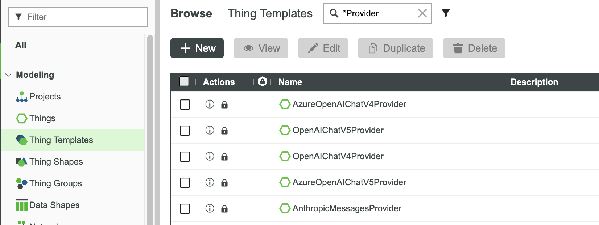

They are:

- `AzureOpenAIChatV4Provider` and `OpenAIChatV4Provider`: Chat Completions clients using `max_tokens` and temperature.
- `AzureOpenAIChatV5Provider` and `OpenAIChatV5Provider`: Chat Completions clients using `max_completion_tokens` and reasoning effort, omitting temperature.
- `AnthropicMessagesProvider`: the Messages API client, with model-dependent sampling and manual-thinking compatibility.

Choose a template by the request shape your deployment supports, not only by the model name. There are no built-in Responses, Gemini or Mistral Provider templates in the 0.1.248 baseline. See [the complete configuration reference](./21-agent-and-provider-configuration.md) for every field and its effective default.

### Create your LLM provider Thing based on a selected Thing Template

Let's create the first LLM provider Thing. In this example, we will use a deployment of `gpt-5.4`:

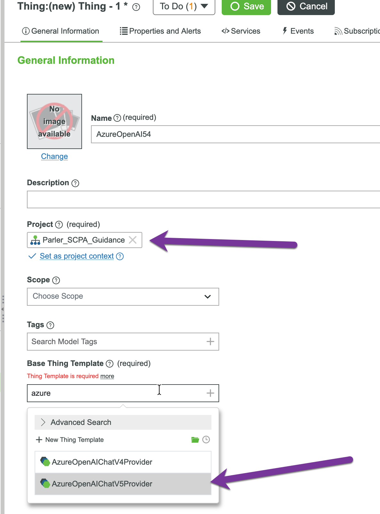

Please make sure to choose the template: `AzureOpenAIChatV5Provider`.

### LLM provider configuration

Configure the endpoint, credential and deployment/model first. Leave Agent `maxTokens` at `-1` when the Provider should own the output allowance. For v5, `maxCompletionTokens` includes reasoning and visible output; choose it using completion evidence, model limits and quota, rather than treating a workshop value as a universal recommendation.

Local rate control can be `disabled`, `observe` or `enforce`. Set limits to reflect the quota this Provider Thing can use. A concurrency limit of 1 and a local wait of 120000 ms are possible workshop choices, not product requirements; the default concurrency limit is 0 (no local concurrency check). Separate Provider Things and ThingWorx processes do not coordinate a shared upstream quota. The [configuration reference](./21-agent-and-provider-configuration.md) explains each control and the effects of increasing or decreasing it.

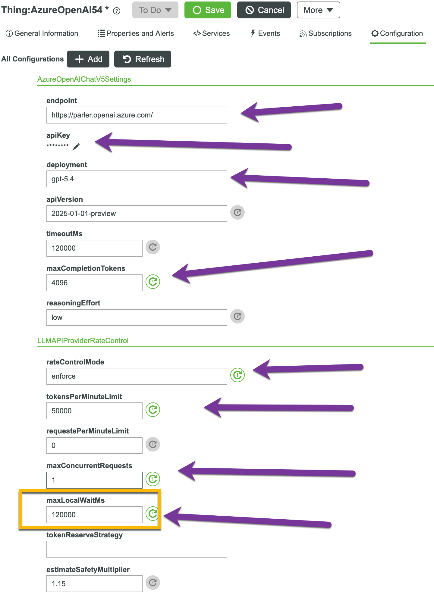


### Specific configuration for Anthropic Sonnet 4.6 and Opus 4.8 on Azure Foundry

When you use the Anthropic models on Azure Foundry, please change the base url into the following pattern.

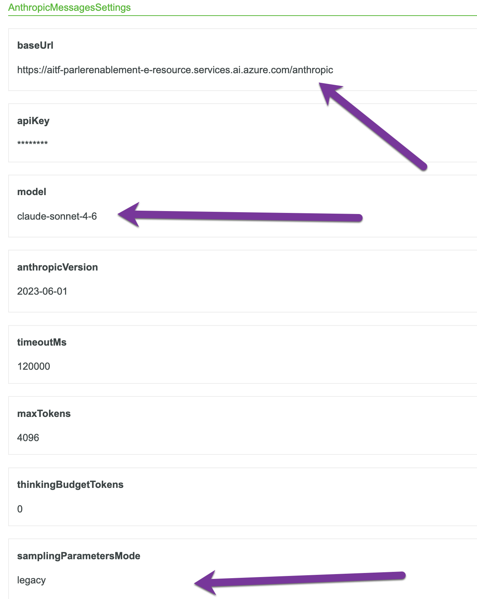

For a deployment that rejects `temperature`, use `samplingParametersMode = omit`. Compatibility depends on the model and endpoint; this setting suppresses the request field rather than changing its numeric value. Keep `thinkingBudgetTokens = 0` for the ordinary multi-round tool workflow with the current Parler adapter.

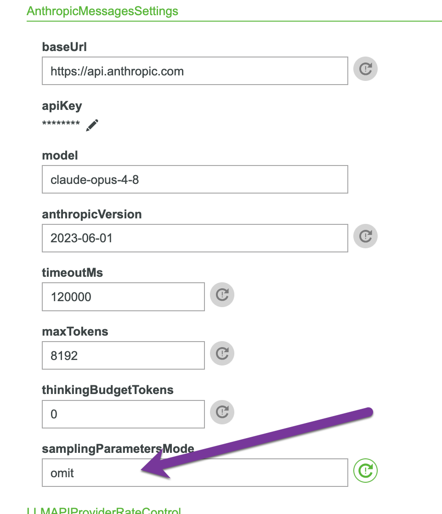

### Test your connection to LLM

Please go to the `Services` tab and select `TestConnection` to run.

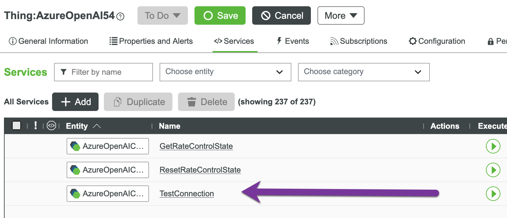

If everything has been configured properly, the result should be true.

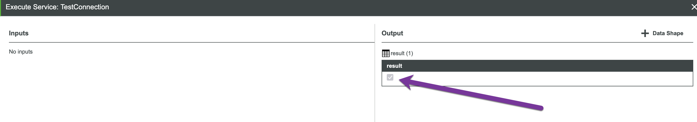


If the result is false, please check your Application log and look for LLM_HTTP_FAILURE. If the message looks like below, that means the IP from your ThingWorx server to the LLM provider is **blocked**.

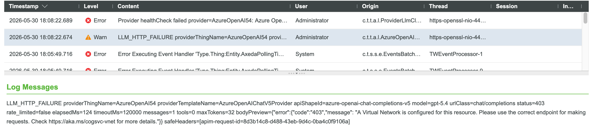


You have to find out the outgoing IP on your ThingWorx instance and ask your admin to put your IP address on the Azure side.

**`Caution`**: The `Public IP Address` on the PTC cloud instance desktop may be wrong, you have to use the following command to ensure you have the right outgoing public IP:

```
Invoke-RestMethod -Uri "https://api64.ipify.org"
```


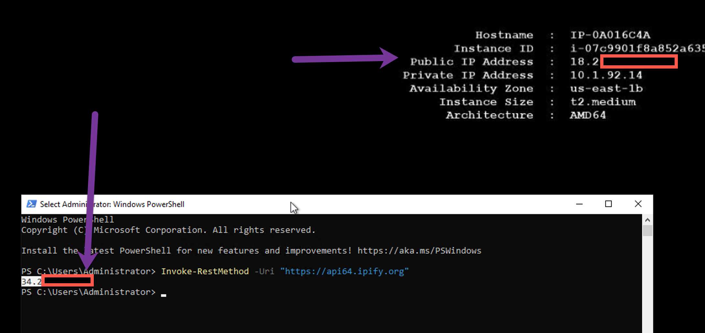

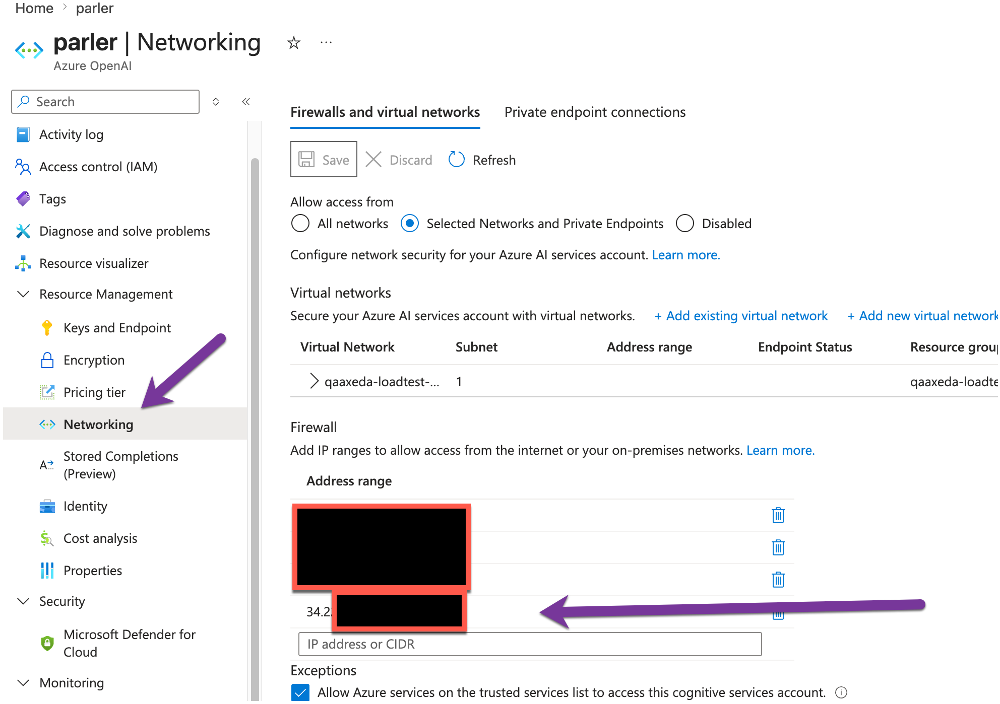


## Three FileRepositories (Artifact Cache is mandatory)

Create separate repositories for configuration, exports, and the Artifact Cache. Starting with
**`parler-agent` 0.1.219**, the Artifact Cache repository is a production prerequisite, not an optional lab
optimization. Chat, ChatAsync, AlwaysOn, structured Playbooks, and post-HITL continuation fail before invoking
the LLM when it is missing or unavailable.

Parler separates **configuration files** from **exported artifacts**:

| Setting on `AIAgent`          | Purpose                                                      |
| ----------------------------- | ------------------------------------------------------------ |
| **`configurationRepository`** | FileRepository holding **`/taxonomies`**, **`/skills`**, **`/playbooks`**, **`/tools/extended_tools.json`**, **`/policies`**, etc. Maintainer details live in **[`docs/agent/configuration-repository.md`](../../docs/agent/configuration-repository.md)** in this repository; the workshop chapters inline the paths you need. |
| **`exportFileRepository`**    | FileRepository for **table exports** and similar outputs (`AgentSettings.exportFileRepository` — **`THINGNAME`** to a **FileRepository**). |
| **`artifactCacheFileRepository`** | Dedicated FileRepository used by tabular, large-JSON, nested-result, derived-insight, history-overlay, and replay cache consumers. It must resolve to a FileRepository Thing before a turn begins. |

**Exercise:** create **three** FileRepository Things—one config, one export, one Artifact Cache—bind all three on
the `AIAgent`, save the Thing, and confirm Composer resolves every `THINGNAME` aspect. Do not reuse the
configuration repository for cache payloads in the course sample.

After saving, run a connection/readiness check before the first prompt. The stable failure meanings are:

| Code | Meaning | First check |
| --- | --- | --- |
| `ARTIFACT_CACHE_NOT_CONFIGURED` | `artifactCacheFileRepository` is blank | Agent Settings row and save/restart |
| `ARTIFACT_CACHE_REPOSITORY_UNAVAILABLE` | configured Thing is missing, not a FileRepository, inaccessible, or its storage operation failed | Thing name, type, permissions, repository root, Application Log |

The cache index is intentionally process-local. Files may survive a restart, but a restarted Agent does not
silently resurrect old public `cacheId` handles. Treat `CACHE_MISS` after restart as a lifecycle fact, not a
reason to bypass the configured repository.


## Create a dedicated `AIAgent` Thing

### Create `AIAgent` Thing

After you have created your LLM provider, you can now create your `AIAgent` Thing.

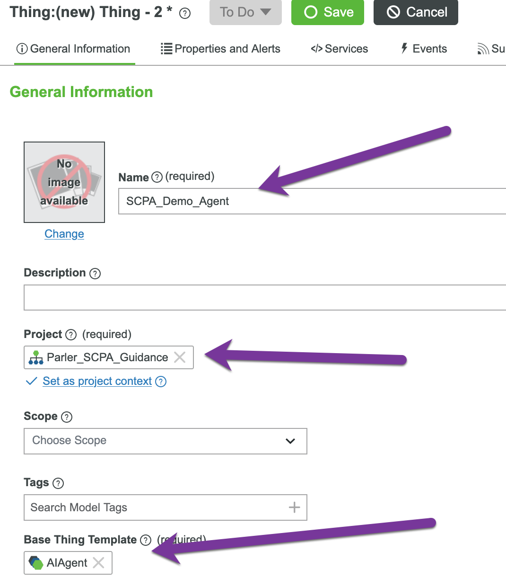

### Configure and set up the LLM provider

You have to go to the configuration tab and set the `LLM API Provider` to the Thing you created in the last step.

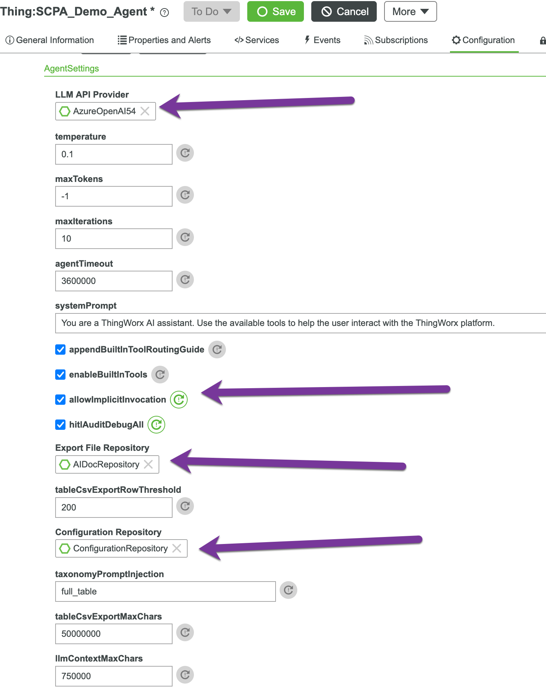


### Test your Agent Thing

You can use the `TestConnection` on the `AIAgent` Thing to test the connection too.

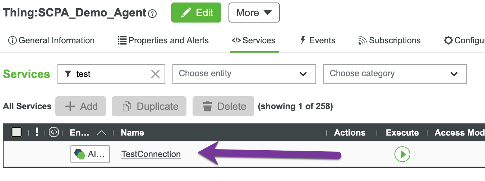

The result should be true if your LLM provider can connect without issues. If the result is false, please check the error the same way as in the last step.

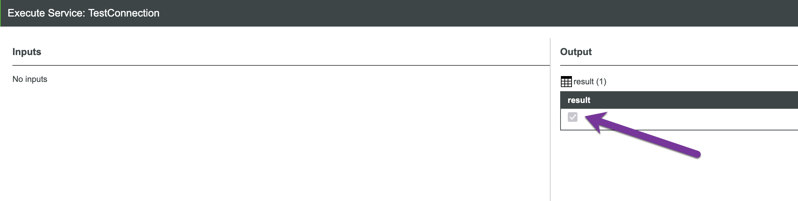

## Two refresh services

There are two `refresh` services on your `AIAgent` Thing. We will use them very often in the next steps.

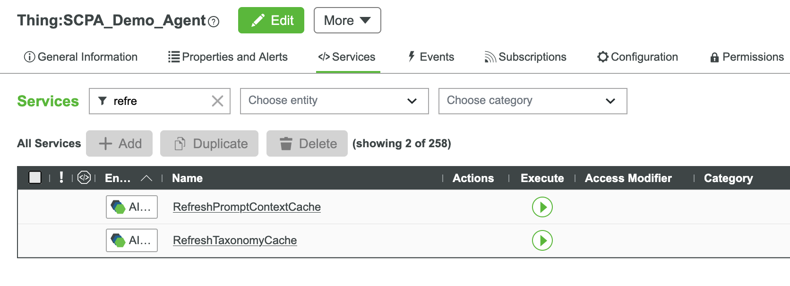
