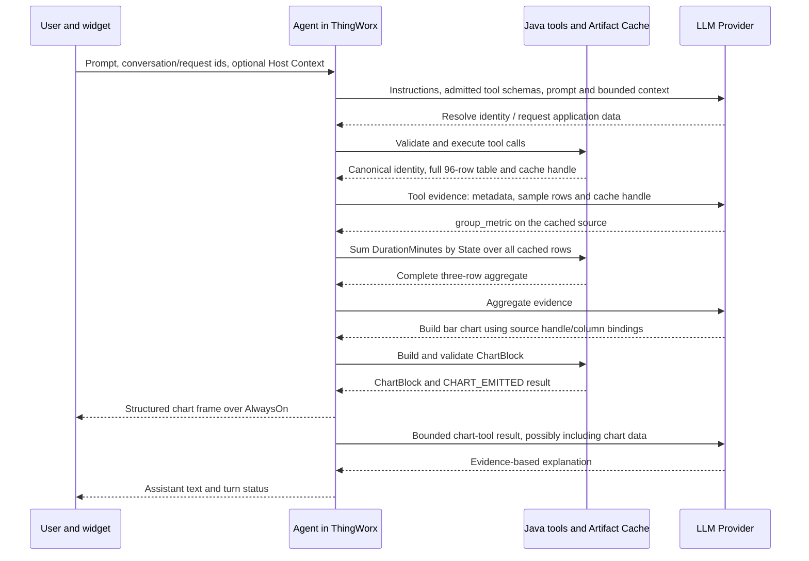

# From a prompt to an answer and a chart

This walkthrough follows **Agent 0.1.248 / Widget 0.1.97**. It separates three responsibilities: the LLM interprets a request and selects operations; Java tools retrieve and compute evidence; the widget renders server-authored artifacts. The LLM can also write the final explanation. These responsibilities have different data boundaries.

## 1. One concrete question

A user asks:

> For Mixer 01, show total minutes in each operating state during 06:00–14:00 UTC on 20 September 2026 as a bar chart. Tell me which state occupied the most time.

For this **illustrative example**, assume the application provides an admitted, read-only extended tool named `get_state_intervals`. This is an example application tool, not a built-in or a claim that the course imports already install it. Its wrapper validates the requested Thing and window and returns an InfoTable with `State` (STRING) and `DurationMinutes` (NUMBER). Intervals are clipped to the requested window, non-overlapping, and complete. Those business rules are the wrapper's responsibility; summing overlapping intervals would give the wrong answer even with perfect arithmetic.

The example assumes its extended-tool manifest entry explicitly sets **`hitl: false`** and no mutating/high-risk capability forces approval. Read-only behavior alone does not bypass approval: omitting `hitl` normally requires a human decision. Without this assumption, Step B pauses for approval before execution; declining it prevents the illustrated data retrieval.

The configured identity resolver maps “Mixer 01” to the illustrative canonical Thing `Acme.Mixer.01`. The wrapper returns **96 five-minute rows**, totaling **480 minutes**:

| State | Number of source rows | Total minutes |
| --- | ---: | ---: |
| Running | 60 | 300 |
| Idle | 24 | 120 |
| Fault | 12 | 60 |

These are teaching numbers, not measurements from a live system. No cause of the Fault intervals is supplied by this data.

The Agent has built-in tools enabled, the extended tool/schema admitted, valid Provider configuration, and an available dedicated Artifact Cache. For clarity this is a fresh conversation without a slash skill or a selected playbook. If Host Context is bound by the Mashup, it is additional input and must agree with, or be reconciled against, the user's explicitly stated scope.

## 2. The two network boundaries



Arrows group related calls for readability; they do not prescribe the exact number or batching of model requests. A model may ask for clarification or additional schema information. The chart and text can arrive in either order, or interleave.

**Widget ↔ ThingWorx** carries the user interaction and structured UI artifacts. **ThingWorx ↔ Provider** carries LLM requests and responses. The widget does not give the LLM a direct connection to the platform, and the LLM does not emit AlwaysOn frames itself.

## 3. What happens in each round

### Step A — receive the prompt and construct model context

The widget submits the prompt through the platform/gateway path. Request and conversation identities associate later events with the correct assistant row. The Agent resolves its Provider and checks turn admission, including Artifact Cache availability.

Before the first model request, Parler assembles applicable system instructions, admitted tool names/descriptions/JSON argument schemas, the user message, and any relevant per-turn context. Taxonomy injection follows `taxonomyPromptInjection`. Skill metadata can be part of the configured context; full skill bodies are included when explicitly loaded. In a continuing conversation, retained conversation text and compacted evidence may also be replayed.

**Sent to the LLM:** the prompt, applicable instructions, schemas and injected context. **Not automatically sent:** all Thing property values, all history rows, the entire configuration/document repositories, Java/JavaScript service implementations, the Mashup DOM or a screenshot. A tool schema describes how to call a Service; it is not the Service's source code.

### Step B — resolve identity and retrieve the source

The model requests identity resolution as needed and receives the canonical Thing name. It can then request the example tool with arguments such as:

```json
{
  "thingName": "Acme.Mixer.01",
  "startTime": "2026-09-20T06:00:00Z",
  "endTime": "2026-09-20T14:00:00Z"
}
```

Those names are the **example wrapper's schema**, not universal arguments for every Parler tool. Parler validates and dispatches the operation. Platform permissions, application admission and any applicable invocation policy remain on the server; an LLM request is not permission by itself. A path that requires approval pauses for a user decision. The diagram's uninterrupted example relies on the explicit `hitl: false` assumption above.

The wrapper executes inside ThingWorx and returns the full 96-row InfoTable. For this `State`/`DurationMinutes` table, the large-table path stores a server-side artifact and returns a result envelope containing a real `cacheId`, column metadata, total row count, a bounded sample and retrieval guidance. The standard tabular evidence threshold is **20 rows**; the LLM does not receive all 96 raw rows in this initial result. Egress size limits can reduce the sample further. Do not assume every large tool result has a handle: for a `name`/`value` NamedVTQ-shaped table, failed sanitization skips caching. That exception does not apply to this example; downstream calls must use an actually returned handle.

**Sent to the LLM:** canonical identifiers, selected time window, column names/types, count, cache handle, sample values, and available warnings/completeness evidence. **Kept server-side at this step:** the other source rows. The handle names a result in the current conversation; it is not a download of those rows to the model.

A sample is not an aggregate. The first 20 intervals could all be Running. The model must not infer the whole-window proportions from that sample.

### Step C — compute over the full cached table

The model requests deterministic grouping. Replace the illustrative handle below with the actual handle returned by Step B:

```json
{
  "cacheId": "<source-cache-id>",
  "mode": "group_metric",
  "groupBy": ["State"],
  "measures": [
    { "name": "minutes", "op": "sum", "column": "DurationMinutes" }
  ],
  "sorts": [{ "fieldName": "minutes", "isAscending": false }],
  "maxItems": 24
}
```

This is a `tabulate_cached_result` call. Java reads the cached source and computes the sums over **all 96 returned rows**, not the LLM sample. It produces three rows: Running 300, Idle 120, Fault 60. Sorting is also performed by code. The group result is small enough for the ordinary inline evidence path, so all three rows can reach the LLM; replay encoding may represent them as a compact matrix rather than repeated JSON objects.

“All cached rows” means the complete cached **query result**, not automatically all rows ever present in the database. If the original reader hit a limit or the wrapper omitted an interval, subsequent exact aggregation does not recover the missing data. Preserve reader-limit/completeness warnings in the explanation. This example's completeness is an explicit premise.

### Step D — request a chart, without generating its points

With the aggregate as the latest qualifying tabular result, the model can request `build_chart_from_tabular_result`:

```json
{
  "source": "last_invoke",
  "kind": "bar",
  "xColumn": "State",
  "yColumn": "minutes",
  "title": "Mixer 01 operating states, 06:00–14:00 UTC",
  "xLabel": "State",
  "yLabel": "Minutes"
}
```

`last_invoke` means the latest **qualifying tabular result**, not any previous tool result or a tool-call id. If another table has since become current, use `source: "cache_id"` and the aggregate's actual returned `cacheId`, when available. A derived-result handle and the original 96-row source handle are different references.

The model supplies a kind, bindings and labels. **It does not supply `x`/`y` arrays, D3 code, SVG, or an image.** Java resolves the table, validates the bindings and finite values, and constructs a ChartBlock whose data includes:

```json
{
  "kind": "bar",
  "series": [
    {
      "name": "minutes",
      "x": ["Running", "Idle", "Fault"],
      "y": [300, 120, 60]
    }
  ]
}
```

This excerpt illustrates the server-authored payload; it is not the whole wire frame. The real block also has identity and source/provenance information. The Agent queues the chart and emits a `type: "chart"` frame for this request. The widget validates the block and draws the chart with D3. The server-created numbers are independent of whether the model's prose later says “300” correctly.

### Step E — let the model explain the evidence

The chart tool returns `CHART_EMITTED` together with chart identity, kind, source/count metadata and **a `chartBlock`**. The normal tool-result egress path applies compaction before the next LLM request. It does **not** universally strip `chartBlock`.

For this three-category chart, the model can receive all three categories and values in the chart-tool result as well as the earlier aggregate. The successful-result compaction path works as follows:

1. The unchanged fast path requires at most **8192 characters** and no `[` character. Chart results contain arrays, so they go through JSON compaction even below 8192 characters.
2. The first pass samples ordinary data arrays longer than **20 elements** to 20; schema/metadata arrays have exemptions. This includes chart coordinate arrays, not just table rows.
3. If the compacted result still exceeds **8192 characters**, a second pass samples ordinary data arrays to **5** and shortens text further.
4. If that is still too large, a last-resort pass can omit `chartBlock` entirely: it is a non-priority object, and original object values exceeding **1500 estimated JSON characters** are omitted at this stage. Smaller objects can also lose space to the overall last-resort budget.

There is a final size safeguard: if the resulting encoding (including omission markers) is not smaller than the raw result, the gateway keeps the raw result. These figures describe compaction decisions, not hard disclosure guarantees. A **many-point line or scatter chart can therefore reach the LLM with only 20 (or 5) elements per sampled coordinate array** while the UI receives all of them, provided the compacted encoding is smaller than the raw result. Small charts such as the three-bar example normally reach the LLM whole. Compaction changes model-facing evidence, not the server-authored UI artifact.

Therefore **“the chart is not generated by the LLM” does not mean “the LLM never sees chart values.”** Do not use the chart pipeline as a promise of zero data disclosure.

A justified answer is:

> Running occupied the most time: 300 minutes. Idle accounted for 120 minutes and Fault for 60 minutes, over the complete 480-minute window. The bar chart shows these totals. These intervals do not identify the cause of the Fault state.

The LLM writes this explanation from evidence. It can still misinterpret units, confuse periods, or add an unsupported causal claim. Deterministic chart construction reduces one class of error; it does not prove every sentence of the answer.

## 4. A precise data-disclosure inventory

“Sent” below means part of the model request content on the applicable path, not necessarily present on every call.

| Data | Reaches the LLM? | Boundary and qualification |
| --- | --- | --- |
| User prompt | Yes | Includes identifiers or sensitive text the user types. |
| System/routing instructions and admitted tool schemas | Yes | Model needs these to select valid operations; the entire developer repository is not auto-loaded. |
| Taxonomy | Depending on injection and tool calls | Optional repository taxonomy Markdown, resolver guidance, or none upfront; `full_table` does not generate tables from taxonomy JSON. Resolved entity data may arrive later. |
| Host Context | When supplied/injected | Selected asset, window, filters or other bound values can be model-visible. It is not automatic access to the whole Mashup. |
| Skill contents and document excerpts | When loaded/retrieved | Metadata, explicitly loaded bodies, search snippets and fetched chunks can be visible. Repository contents are not all sent by default. |
| Tool-call names and arguments | Yes, as part of the exchange/replay | Canonical Thing names, service names, time ranges and filters can be exposed. |
| Full large cached table | Not by default as one result | Initial evidence uses schema/count/sample/handle. Explicit fetches can disclose additional rows; small tables may be sent whole. |
| Computed aggregate | Yes, within evidence budgets | The three totals in this example are intentionally visible. |
| Chart data and metadata | Can be | The chart-tool result includes `chartBlock`; Step E describes 20/5-element sampling, the 8192-character soft budget, conditional last-resort omission above 1500 estimated characters, and the keep-raw size safeguard. The UI may display more values than the model receives. |
| Rendered SVG, pixels, hover state and UI theme | No automatic transmission in this flow | Browser rendering and interactions are local presentation. A separate explicit tool/input could change that boundary. |
| Provider `apiKey` | Not as model prompt text | The HTTP client sends it to the Provider endpoint as authentication. This is still transmission to the Provider service. |
| Full logs, platform source, all repository files | No automatic transmission | Custom tools or user-pasted content can expose them; the fact they exist on the server does not itself include them in prompts. |

Compaction is a **size/evidence-management mechanism**, not general-purpose secret redaction. Model context can contain real samples and identifiers. Application wrappers should select the fields needed for the task and enforce their own data boundaries. A result classification label is not the same as removal of its contents.

There are also different kinds of “cache”: Parler's Artifact Cache holds server-side query artifacts; conversation compaction limits replay; a vendor's prompt cache can reuse context already submitted to that vendor. None implies that data already sent upstream has been withdrawn.

## 5. Benefits and their costs

| Design choice | Benefit | Trade-off |
| --- | --- | --- |
| Server-side aggregation over cached source | Correct, repeatable arithmetic without asking the model to total a large sample | Only supported operations are available; business semantics, scope and source completeness must still be right. |
| Model emits intent/bindings, server constructs chart | No model-generated point arrays or executable chart code; data can be traced back to a result | The model can still choose the wrong column, title, unit or chart kind. Validation cannot infer all business meaning. |
| Bounded evidence instead of repeatedly sending whole tables | Lower input volume and less bulk data exposure | Samples omit information; exact conclusions may need another aggregate or fetch round. No fixed cost-saving percentage is guaranteed. |
| Separate text and chart frames | Chart can render before final prose; UI can provide consistent interactions and history display | Text and chart can disagree, and a chart success does not imply text success. Matching versions/contracts matter. |
| Fixed chart vocabulary and validation | Predictable rendering, fewer malformed artifacts, consistent UI | Arbitrary visuals require product work; unsupported data should produce a table, explanation or error rather than invented points. |
| Reuse a cached result | Multiple analyses/charts use the same observed data snapshot | It is not a live refresh. Expired/unavailable handles require a new read, whose data may differ. |

A playbook can make the sequence of supported steps deterministic once it is stable. A skill can guide the model toward the right workflow. Neither turns prose into an authoritative calculation or silently adds a missing chart type. The [chart catalogue](./23-supported-charts-and-tradeoffs.md) explains which visual encodings the server and widget actually support.
